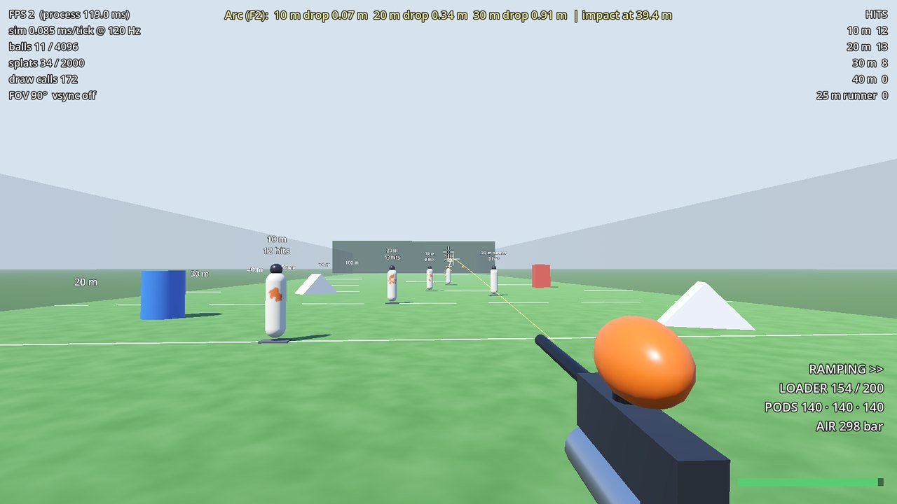
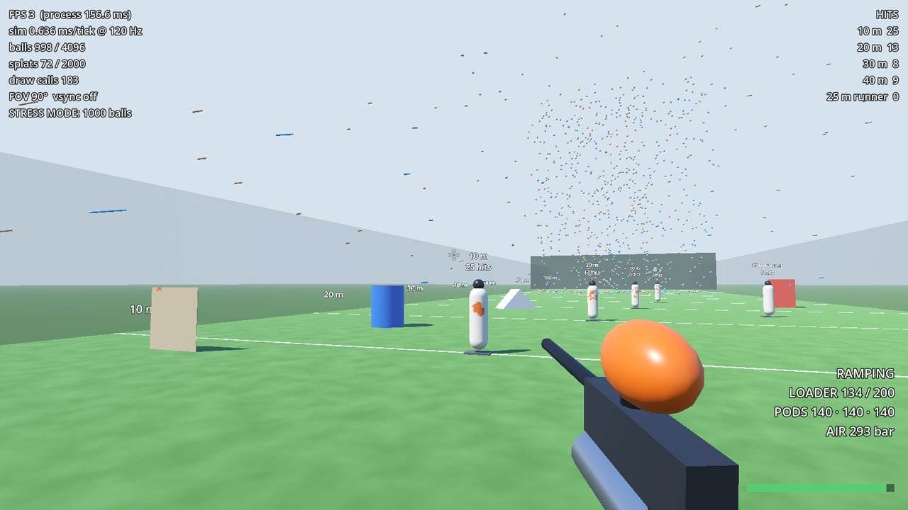
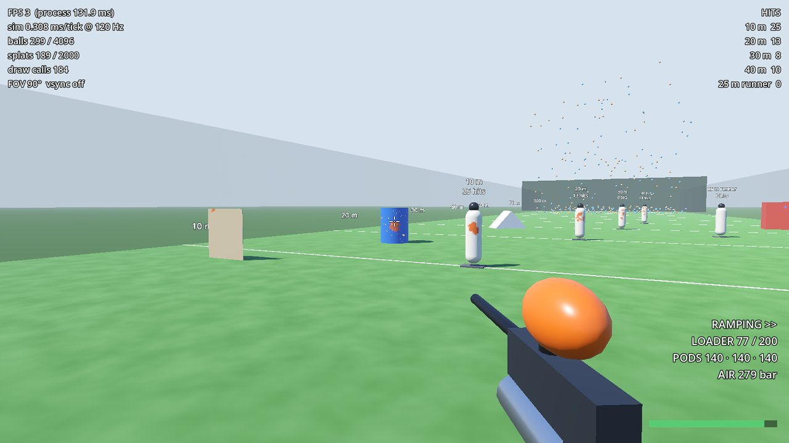

# Phase 1 report: ballistics sandbox

**Date:** 2026-09-30 · **PR:** [Tim-D-W101/Pb#1](https://github.com/Tim-D-W101/Pb/pull/1)
**Status:** complete, except the frame-rate check, which needs your PC (see [Performance](#performance)).

## What was built

- **Engine-free simulation core** (`src/Pb.Sim`, plain C#, no Godot references):
  - **Ballistics:** paintball flight with quadratic drag and an RK2 integrator at 120 Hz. Swept collision runs every tick, so balls can't tunnel through thin geometry. The break-vs-bounce curve is set per surface in data, and bounced balls never eliminate.
  - **Shots:** cone dispersion and ±1.5 m/s velocity variance, driven by per-shot seeds.
  - **Marker:** semi and ramping modes. The 10.5 bps cap is exact because shots are scheduled with sub-tick timing.
  - **Loader and pods:** loader 200, pods 3 × 140, and an interruptible 2.5 s refill that blocks firing.
  - **Air:** 1.1 L / 310 bar tank. About 1,000 full-velocity shots per fill, then muzzle velocity drops.
- **Data files** (`game/data/*.jsonc`): every gameplay number, with commented, unit-suffixed keys. Unknown or missing keys and out-of-range values are rejected with the file and key named. **F9** reloads everything in game.
- **Playable range** (`game/`):
  - **Movement and look:** first-person walk/run/sprint/crouch on keyboard/mouse or gamepad. FOV is 70–110°, measured horizontally at 16:9. Head-bob is minimal.
  - **Viewmodel:** greybox marker, loader and tank, drawn with their own FOV so they never clip into cover.
  - **Targets:** dummies at 10/20/30/40 m plus a moving runner, all with hit counters. There are also inflatables for bounces and a 1 cm panel that tests swept collision.
  - **Paint:** balls drawn with a minimum on-screen size and faint motion streaks. Team-coloured splat decals are capped at 2,000, with the oldest fading first. Impact bursts show where balls land.
  - **Sound:** placeholder synthesised audio. The shot's pitch follows tank pressure.
  - **HUD:** crosshair, loader, pods, air in bar, fire mode, refill progress, hit tally, and a performance overlay.
  - **Debug tools:** arc preview (**F2**) with drop readouts, and stress mode (**F3**) that keeps 1,000 balls in the air.
- **Automated checks:**
  - 56 unit tests.
  - A headless benchmark.
  - A headless end-to-end smoke test: the real scene runs with an autopilot and stress mode, and hot-reloads the data halfway.
  - All of these run in GitHub Actions.

## Acceptance checks

| Spec check | Result | Evidence |
|---|---|---|
| Ballistic unit tests pass | ✅ | 56/56 pass (below) |
| 1,000 live balls at 60 fps | ⏳ your PC | Sim cost at 1,000 balls is about 0.2 ms per 60 fps frame. The frame-rate check needs a real GPU. |
| Visible arc and drop | ✅ | The arc preview reads "20 m drop 0.34 m", and distance lines run to 100 m (screenshot 1) |
| Break/bounce works | ✅ | Break statistics and tunnelling tests pass. Splats and bounces appear in play (screenshots 2–3). |

### Ballistics: shipped data through the real sim code

| Level shot from 1.5 m at 88 m/s | Spec | Measured | Independent RK4 reference |
|---|---|---|---|
| Drop at 20 m | ≈ 0.35 m | 0.343 m | within 1% |
| Speed at 20 m | ≈ 58 m/s | 57.7 m/s | within 1% |
| Drop at 30 m | ≈ 0.92 m | 0.912 m | within 1% |
| Max range | ≈ 93 m at ~30° | 93.1 m at 30.0° | within 1% |
| Full-velocity shots per air fill | ≈ 1,000 | 1,000 | – |

Other tests cover:

- 0 of 10,000 balls tunnelling through the 1 cm panel.
- Head-on hits at 58 m/s break over 99% of the time; 15° glancing hits at the same speed break 10–30% of the time.
- Bounced paint produces zero eliminations.
- Dispersion stays inside the 0.6° cone and fills it uniformly.
- Ramping at 8 pulls/s gives 630 ± 2 shots per minute, exactly evenly spaced.
- Loader, pod and refill rules; air fall-off.
- Bit-identical replays from the same seed.
- Zero memory allocations per tick with 1,000 live balls.
- Grid broadphase agrees with brute force over 20,000 random segments.
- Data validation messages.

## Performance

Sim cost per tick, Release build, on a 4-core cloud VM. It runs twice per frame at 60 fps.

| Live balls | Mean | p95 | Per 60 fps frame |
|---|---|---|---|
| 1,000 | 0.09 ms | 0.11 ms | 0.19 ms |
| 2,000 | 0.20 ms | 0.22 ms | 0.39 ms |
| 5,000 | 0.52 ms | 0.66 ms | 1.03 ms |

The editor's F5 run uses a Debug build, which is about 5× slower (0.54 ms per tick at 1,000 balls) and still small. Rendering 1,000 balls takes a single draw call.

The headless smoke test peaked at 1,001 live balls over 900 ticks, with 78 autopilot shots, 180 breaks, about 5,900 bounces, 70 target hits and zero errors.

**The one check left, about a minute on your PC:**

1. Run the game (an exported release build gives the truest numbers: Project → Export → Windows Desktop).
2. Press **F3** (stress mode) and **F8** if v-sync is on.
3. Read the FPS in the top-left overlay. The target is **≥ 60 fps at 1080p** on a GTX 1070-class GPU.

If you're short: `splat.cap` and `minPixels` in `presentation.jsonc` are the first levers, and please tell me your GPU.

## Screenshots

These were rendered with a CPU software renderer in the cloud (no GPU), so they show what's drawn, not how fast.

**1 · Target practice with the arc preview.** The HUD shows the drop at each distance, the gear panel (loader, pods, air in bar) and the hit tally.

**2 · Stress mode: 1,000 live balls** arcing downrange. Balls stay visible at distance thanks to the minimum on-screen size.

**3 · Splats and bursts** on the Can inflatable and the dummies.

## How to run

1. Install **Godot 4.7.2 .NET** and the **.NET 8 SDK**.
2. Open `game/project.godot` and press **F5**. Click to capture the mouse.
3. For controls, sandbox keys, and where every tunable lives, see the [README](../../README.md).
4. To run the tests without Godot: `dotnet test`.

## Known issues and limitations

- **Frame rate is unverified on a real GPU** (see above). The 2,000-decal cap in particular hasn't been measured on a GTX 1070. Lower `splat.cap` if needed; Phase 5 swaps decals for splat shaders.
- **Greybox everything:** primitive-shape marker, synthesised placeholder sounds, a flat sky. The loader is deliberately large, as in real life. Its size and position are in `presentation.jsonc` (`viewModel`).
- **Ramping is authentic** "walk the trigger": after 3 fast pulls you must keep pulling at ≥ 5 per second to sustain the 10.5 bps cap. Holding the trigger doesn't auto-fire. It's tunable in `markers/standard.jsonc`. Say if you'd like a hold-to-fire option for gamepad.
- **Balls ignore the shooter's own velocity** by default (`inheritShooterVelocity: 0`). At 1.0 (physically correct), strafing at 5.5 m/s would push shots about 3.6° sideways. It's your call as a realism knob.
- **Crouch doesn't check headroom before standing.** The range has no overhangs; this gets fixed with bunkers in Phase 2.
- **Hot reload (F9)** refills gear and resets splats and hit counters. Tick rate and ball-pool size need a restart, and the game says so.
- **No ball-vs-ball collision** (genre standard, as planned).
- **Audio is skipped in headless runs.** Godot's dummy audio driver never retires finished sounds, so the smoke test runs silent.
- **Harmless exit warning.** Quitting while a sound is still playing can print "N ObjectDB instances were leaked at exit". It's only the playing sounds; nothing leaks during play.
- **Repo housekeeping:** GitHub's default branch is still `claude/nifty-meitner-exeh6k`. Switch it to `main` in Settings → Branches.

## Deviations from the plan

- The **tank sits under the receiver**, a little forward of a real setup, so it's visible in first person as the spec requires.
- **Arc preview readouts** are a HUD line instead of 3D labels, which overlapped along the line of sight.
- **Distance signs** appear on the left only, at the distances listed in the range file, to keep the horizon readable.
- Game-side data became `presentation.jsonc` and `input.jsonc` rather than a single `debug.jsonc`.
- **Build setup:** Godot 4.7's editor builds `game/Pb.csproj` directly. `Pb.sln` at the root is for the command line and IDEs.

## What's next: Phase 2, offline speedball vertical slice

From the spec:

- **Field:** a greybox 45 × 36 m field loaded from data, with a bunker catalogue (Dorito, Snake, Can, Temple, Cake, Brick), auto-mirrored layouts, and start boxes with a buzzer.
- **Movement:** full movement with lean, slide/dive, shoulder-swap and snap-shooting.
- **Players:** player hitboxes (body, mask, marker, loader, tank), eliminations, a spectator camera, and mask paint spray.
- **Rules:** speedball rounds (horn countdown, 3-minute timer, buzzer hang, race to 4).
- **HUD:** match HUD with an alive/eliminated bar, timer, score and kill feed.
- **Bots:** 5v5 bots that break out, hold, advance, flank and hang the flag, with Easy/Normal/Hard settings.
- **Acceptance:** finish a race-to-4 match against bots, with bots breaking out, holding cover and eliminating players.

**Useful from you before Phase 2:**

- your FPS result and GPU;
- how the ball speed, drop, break rate and ramping feel;
- any tuning you've already changed in the data files.
