# Phase 2 report: the compound

**Date:** 2026-10-05 · **PRs:** [Tim-D-W101/Pb#1](https://github.com/Tim-D-W101/Pb/pull/1) (Phase 1, then Phase 2
up to the second day of art), [Tim-D-W101/Pb#2](https://github.com/Tim-D-W101/Pb/pull/2) (the art pass from
2026-10-02) and [Tim-D-W101/Pb#3](https://github.com/Tim-D-W101/Pb/pull/3) (the last art and this report). Each is
stacked on the one before, so they merge in that order.
**Status:** built. Two things are left:

- **your play-test** on your PC: 60 fps on Medium with ten people in the round, and how the opponents feel (see
  [Performance](#performance));
- **four generated props and a clip**: the stacked tyres, sandbag wall, pallet stack and generator, and a crouched
  walk for the opponents. Higgsfield allows five generations a day and today's are spent, so they come with
  tomorrow's. Until then those props keep their detail models built in code, and a crouched opponent steps
  procedurally.

The plan, with every item's details and dates, is [phase-2.md](../phase-2.md).

## What was built

You asked for a realistic game set in old abandoned buildings in a compound, exploring and then fighting
different people, up to ten in a round, with levels by difficulty. Phase 2 delivers one complete level of that.

- **A level kit and the first compound** (M2.1). Levels are data (`levels/*.jsonc`) built from a kit (`kit/*.jsonc`:
  four building templates, 27 prop types with proxy colliders, 37 materials). One definition makes the visible
  meshes, walking collision, paint colliders, occluders and the bots' navigation, so they can never disagree.
  **Oxbarrow Works** is about 110 × 80 m: a warehouse with a mezzanine and half its roof fallen in, a two-storey
  office block, a pump house, a guardhouse, a yard of containers and a burnt-out car under a water tower, and a
  perimeter wall with breaches; 546 primitives and 95 props.
- **Movement** (M2.2): lean with a wall check, a shoulder swap that really moves the muzzle (a barrel behind a wall
  edge breaks the ball on it), slide, jump, stairs, a headroom check, snap-shooting timings, and footsteps whose
  noise depends on pace and surface. All in `movement.jsonc`.
- **Hitboxes and eliminations** (M2.3): a hitbox rig in the sim (mask, head, torso, arms, legs, marker, loader, tank)
  posed by stance, lean, shoulder and aim, with 200 ms of history for multiplayer. One break on any part puts you
  out, a bounce never does, and balls already in the air still count. The hit player calls "Hit!", raises the
  marker and walks off; when you're hit, the camera shows who got you; paint close to your face sprays your mask.
- **Rounds** (M2.4): briefing, live, round end (cleared, eliminated, traded or time up) and a summary, with the
  clock, paint and air pickups and stats; a main menu, level select, briefing card with a plan of the level, pause
  menu with settings, and a loading card. The ladder file lists the levels coming in Phase 3, shown locked.
- **Opponents** (M2.5): bots that send the same inputs a player does, with the same body, marker and rules. They see
  (a vision cone and a detection meter), hear shots, breaks and footsteps (muffled by walls), and remember where
  you were. They patrol or hold posts, investigate, engage from cover, flank, push and search. Sentries,
  patrollers, rushers and hunters; Easy, Normal and Hard in data. A navigation grid (223,700 places) and 891 cover
  points are built from the level as it loads, in under 0.1 s. F3 shows what they see and think.
- **Modes** (M2.10, after your request): solo (you against a squad of 3–9), free-for-all (4–10 players) and teams
  (2 v 2 to 5 v 5). Difficulty sets how good the bots are, never how many there are; the last team standing wins;
  friendly fire puts you out; you can watch your teammates after you're out.
- **The match HUD** (M2.7): a top bar with each player in or out, the clock, a kill feed with callsigns, subtitled
  callouts, pickup prompts, a hit marker and a drawn gear panel (loader, pods and air, warning when paint is low).
- **From your first play-test** (M2.9): v-sync on by default, lighter presets and a render-scale setting, random
  starts every round, and a Windows build from every CI run with a launcher that downloads only the files that
  changed (art in one pack per asset).
- **The art pass** (M2.6), with Higgsfield and in code:
  - **30 photographic materials** from ten generated pictures, each made tileable with normal and roughness maps,
    on every building, the ground and the props. Their tile sizes follow the real pattern, and those without a
    regular pattern are shuffled in patches so the repeat doesn't read as a grid.
  - **Light and air:** four presets (Low to Ultra), sunbeams with dust through the windows and roof holes, daylight
    spilling in, about 50,000 tufts of weeds and dry grass that sway and part as you walk through, a cloud deck on
    the wind, trees, a town's edge on the horizon, and crows.
  - **Props:** all 27 types are modelled. The oil drum and the burnt-out car are generated models; the rest have
    detail models built in code from their colliders (pallets, crates, tyres, sandbags, a generator, a forklift,
    racking, the water tower and so on), wearing the photographic materials.
  - **Three generated, rigged opponents** with generated walk and run clips shared across all three, posed to their
    hitboxes every frame: crouching, leaning, aiming, feet on the ground and both hands on the marker. They flinch
    when hit, refill from their pods in plain sight, wear team armbands, and take paint where the ball hit.
  - **The generated marker**, loader and tank in your gloved hands and in every opponent's, with refilling from a pod
    played in your hands. Your own body casts your shadow, and shows once you're out.
  - **Dressing:** framed windows with broken glass, gutters, trusses, lamps and fittings, barbed wire, painted
    markings and stencils, graffiti of invented words, old paint from past games, cracks, oil and puddles, damp,
    rust streaks, debris, cobwebs, things on the office walls, footprints, ripples and roof drips.
  - **Around it:** the compound behind the main menu, and the training ground (the Phase 1 range) dressed to match.
  - **Fallbacks:** without the art, materials go back to their procedural look, props to their coded models (then
    grey boxes) and opponents to their hitboxes. CI's bot match runs that way, so nothing depends on the art.

**Today (2026-10-05)** finished the art in [Tim-D-W101/Pb#3](https://github.com/Tim-D-W101/Pb/pull/3):

- the last ten materials (pump machinery, the car body, both drums, pallet boards, tyre tread, burlap, tarp, dirty
  glass, and a laminate for the desks), each cut from its picture to suit the coded shape that wears it;
- the burnt-out car as a generated model, with its colliders refitted to it;
- the generated marker in first person and in the opponents' hands, its grips and wrists as points in data
  (`presentation.jsonc` → `markerModel`);
- a fix: every copy of an opponent model had the same tint, so the fourth opponent looked just like the first; each
  copy now gets the next tint.

## Acceptance checks

| Check from the plan | Result | Evidence |
|---|---|---|
| Clear Level 1 on Normal: explore, pick up paint, and eliminate 6 opponents who patrol, investigate, take cover and flank | ⏳ your play | Sim tests have bots patrol, come to look at a shot, take cover and shoot back from it, push, refill and walk off. CI plays whole rounds with a bot in your slot (solo, 3 v 3 and an eight-player free-for-all). That bot only sweeps the spawns, so it doesn't clear Normal: in the sim test it puts out one of six and is out at 32 s. The round's screens are below. |
| 10 people in one round at ≥ 60 fps on a GTX 1070-class GPU, Medium | ⏳ your PC | The sim's share is small: 0.28 ms a tick with ten players and about 1,000 balls in the air, and 0.02 ms for nine Hard bots' brains (below). Only your GPU can measure the rest. |
| Different levels by difficulty | ✅ | The menu offers Oxbarrow Works in three modes, several sizes and three difficulties; the ladder lists the Phase 3 levels as locked (CI's menu smoke test checks it). |
| Rules and ballistics tested | ✅ | 191 sim tests, all green, and CI green with the headless bot matches. |
| Realistic look | ✅ (four props to come) | 30 photographic materials; three generated, rigged and animated characters; the generated marker, oil drum and car (screenshots below). |

### Tests

`dotnet test` runs **191 sim tests** (56 at the end of Phase 1). They cover each row of the plan's test table:

- **Level kit:** openings where the file says (a ball through a window passes, one into the wall beside it hits);
  walking, paint and navigation geometry agree; long shots match a brute-force reference; bad references fail with
  the file and key named, and art without a provenance record fails a test.
- **Hitbox rig:** stance, lean and shoulder swap move the right parts; a lean exposes only that side.
- **Eliminations:** breaks on lethal parts, never bounces; balls in flight still count; trades.
- **Round rules:** each outcome in each mode, placings and ties, friendly fire, the settle window, time up, pickups
  and stats, and starts that are fair for every mode and size.
- **Bots:** nobody seen through a wall; detection slower at range, in the dark, crouched and still; shots heard
  less through walls; the aim solver within 5 cm of a still target at 10–40 m and within 10 cm of one running
  across at 25 m; each tier at least as good as the one below; whole rounds from 30 sets of random starts.
- **Determinism and cost:** the same seed and inputs give the same round, and stepping allocates nothing, whether
  with 1,000 balls in the air, in a live solo or free-for-all round, or with a full squad of bots thinking.

CI also runs the game headless (`tools/ci/smoke-test.sh`): the menu, the range under a 1,000-ball stress test, a
walk through the level (two flights of stairs, a slide, a jump and a duel each way against real bots), the three bot
matches, and the art importer's self-test, all with zero sim errors.

## Performance

Sim cost per tick, Release build, on the 4-core cloud VM (`dotnet run -c Release --project tools/Pb.Bench`). The
sim ticks at 120 Hz, so twice per 60 fps frame.

| Oxbarrow Works | Mean | p95 | Per 60 fps frame |
|---|---|---|---|
| 979 balls in the air | 0.15 ms | 0.19 ms | 0.30 ms |
| 1,959 balls | 0.29 ms | 0.33 ms | 0.57 ms |
| 4,898 balls | 0.72 ms | 0.92 ms | 1.44 ms |
| **10 players and 979 balls** (budget 0.5 ms) | **0.28 ms** | 0.37 ms | 0.56 ms |

Nine Hard bots' brains take 0.02 ms a tick in solo and 0.08 ms in a free-for-all, where each watches all the others.
The worst single tick varies between runs on the shared VM (0.45 ms when M2.8 was measured, 2.2 ms today).

Rendering was only ever measured under software rendering in the cloud container, which says what's drawn but not
how fast. Along the way each effect's cost was measured over the level's viewpoints, and the presets were cut back
after your play-test: Medium is about 1.2 times the cost of Low.

**Your check, about five minutes:**

1. Run the latest test build (`Play.bat` updates it) and start Oxbarrow Works as **Free-for-all** with **10
   players**, or **Solo** with **9 opponents**.
2. Make sure the preset is **Medium** (F12 cycles them; the pause menu shows which), and press **F8** to turn v-sync
   off for the reading.
3. Press **F4** for the performance overlay and play a round, looking across the yard and the warehouse. The target
   is **60 fps or more at 1080p**.

If it's short, the levers are, in order: render scale (pause menu → settings), then Medium's weeds and shadows
(`presentation.jsonc` → `graphics.presets`: `weedDensity`, `weedDistance_m` and `shadowDistance_m`). Please tell me your GPU and the figures,
and how the opponents felt: too sharp, too slow, too predictable?

## Higgsfield spend

248.5 credits of the 400 you allowed (of 541), so about 297 are left:

| Item | Credits |
|---|---|
| Oil drum (30) and three characters (38 each) | 144 |
| Walk and run clips (8 each) | 16 |
| Burnt-out car (18, Tripo H3.1) and marker (30) | 48 |
| 30 materials in ten pictures, reference pictures and concept art | 40.5 |
| **Spent** | **248.5** |
| To come: four props (18 each) and the crouched walk (8) | 80 |

## Screenshots

These were rendered in the cloud container with Mesa's software Vulkan, so the look is right but frame rates mean
nothing. All 113 shots from the phase are in [phase-2/](phase-2/), named by milestone.

**The compound as it stands**, from the level's viewpoints on the Medium preset:

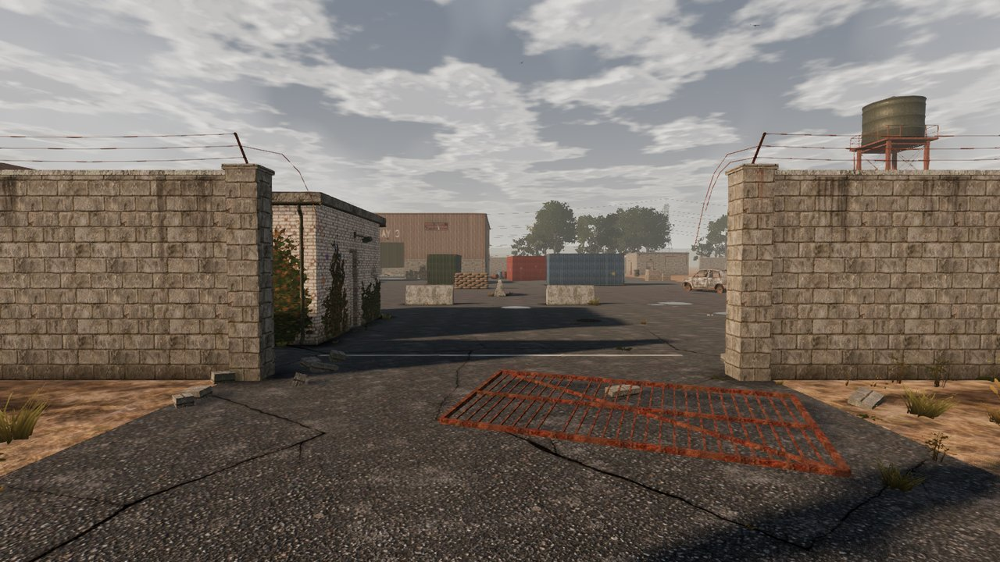
*The main gate, where you come in: a gate leaf off its hinges, the guardhouse on the left and the yard beyond.*

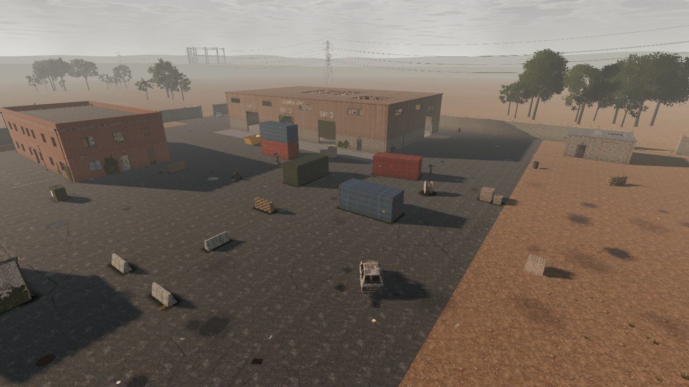
*Over the yard: the office block, the containers, the burnt-out car and the warehouse, pylons on the skyline.*

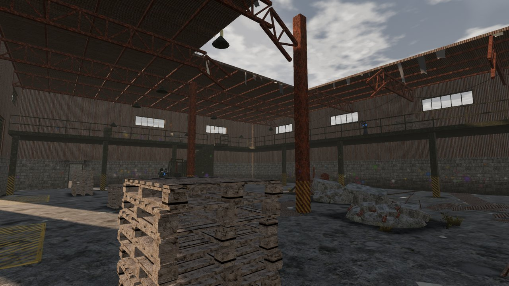
*Inside the warehouse: rusty trusses, the mezzanine, sheets of roof fallen through the hole.*

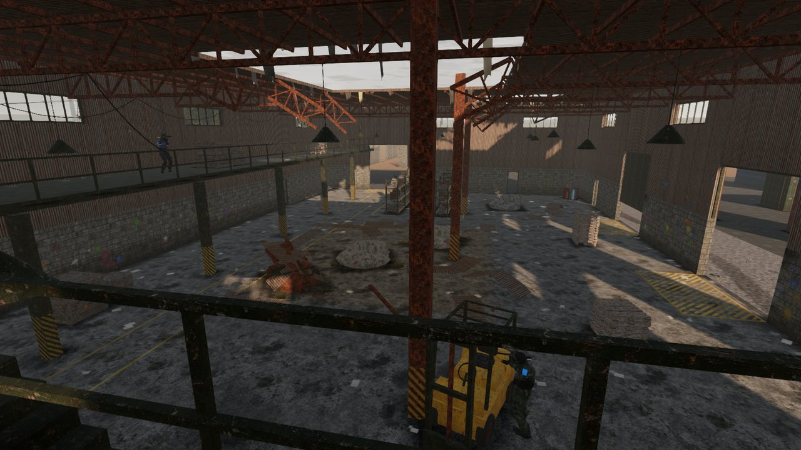
*From the mezzanine, with an opponent on the far walkway.*

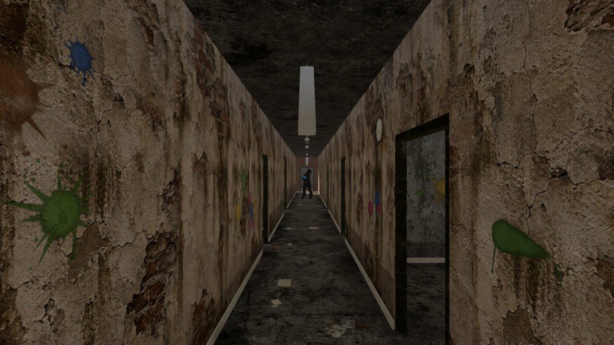
*The office corridor: peeling plaster, old paint, a fluorescent fitting hanging from one end.*

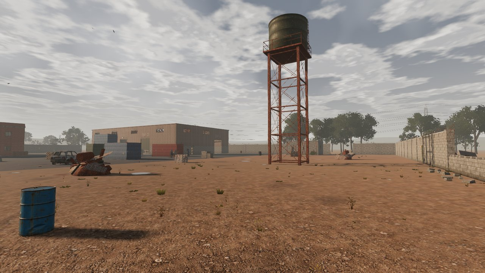
*The east field and the water tower.*

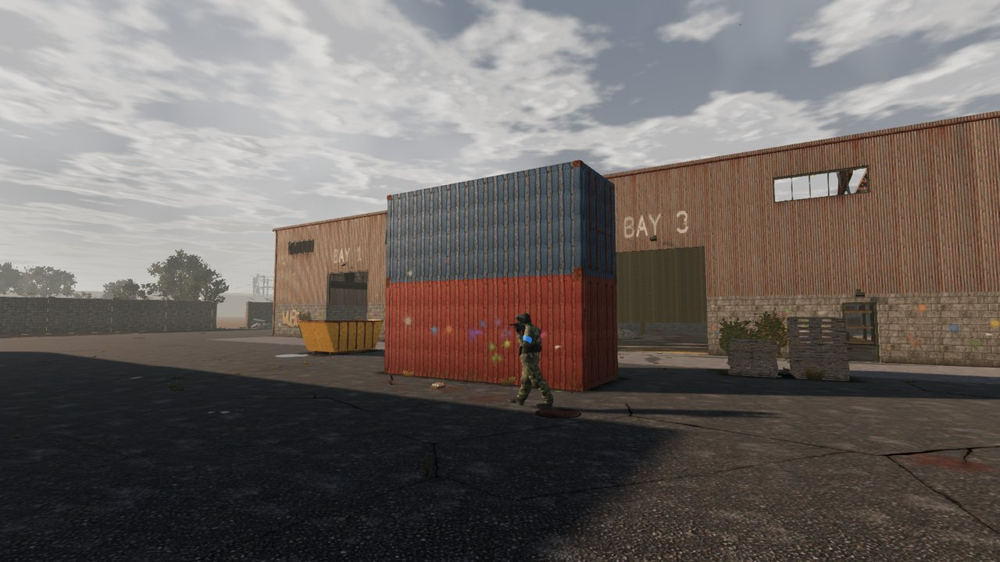
*The containers by the warehouse, an opponent on patrol.*

**Today's art:**

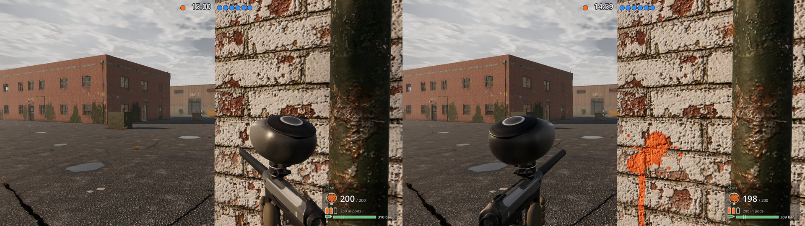
*The generated marker in your gloved hands on the right shoulder, and on the left after a swap (the orange splat is
the shot the wall's edge stopped from the right).*

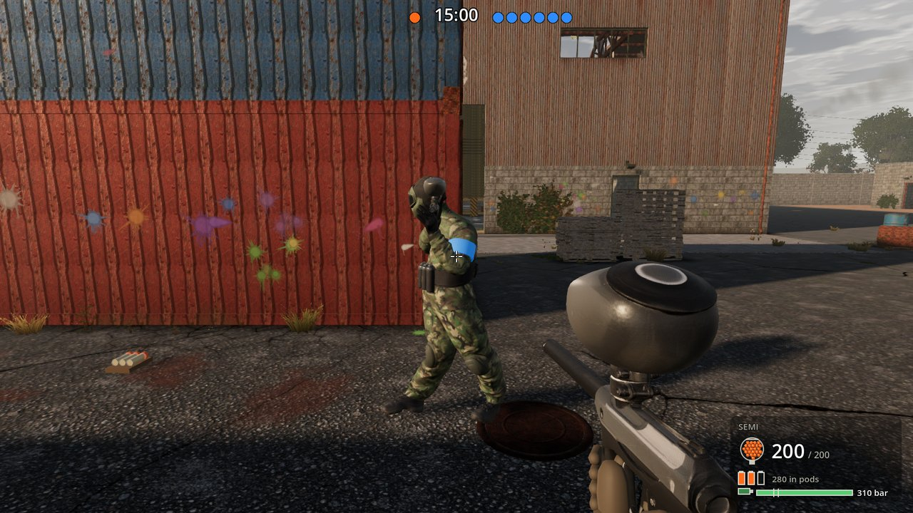
*An opponent holding the same marker, with the match HUD and gear panel.*

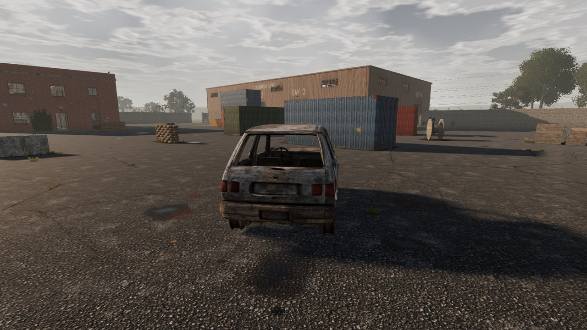
*The generated burnt-out car in the yard.*

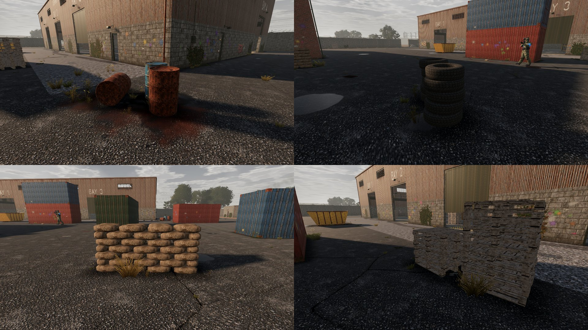
*The last materials on the props built in code: drums, tyres, sandbags and pallets (their generated models come next).*

**People and rounds:**

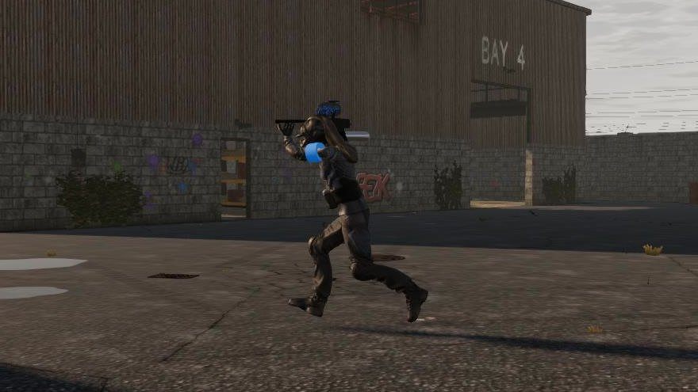
*Opponent C running with the generated run clip.*

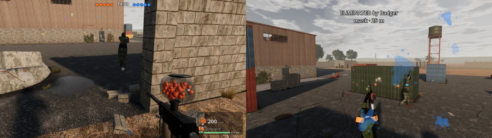
*Your own shadow while you play, and you, hit, from the spectator camera.*

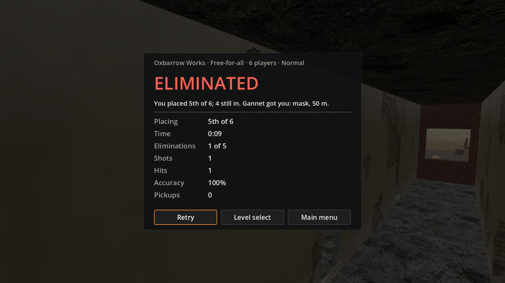
*The summary after a free-for-all.*

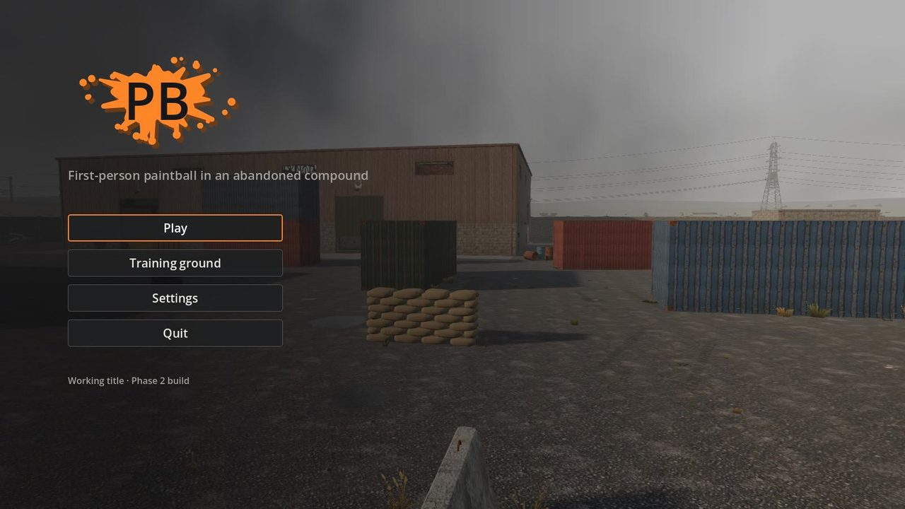
*The main menu, over the compound itself.*

## How to run

- **Play on Windows:** download [Pb-windows.zip](https://github.com/Tim-D-W101/Pb/releases/download/test-build/Pb-windows.zip),
  unzip it and run `Play.bat`; it keeps itself up to date. **Play**, pick Oxbarrow Works, a mode, a size and a
  difficulty, then **Start**.
- **From Godot 4.7.2 .NET:** open `game/project.godot` and press F5.
- **Controls and debug keys** are in the [README](../../README.md#controls).
- **Without Godot:** `dotnet test` for the sim tests, `dotnet run -c Release --project tools/Pb.Bench` for the
  benchmark.
- **Scripted views** (also how these screenshots were made): `-- --shots` tours the level's viewpoints,
  `-- --duel-demo`, `-- --bot-demo`, `-- --posture-demo` and `-- --round-tour` play short scripted scenes, and
  `-- --bot-match` lets a bot play your slot (see [CLAUDE.md](../../CLAUDE.md) for the full list).

## Known issues and limitations

- **The frame rate is unchecked on a real GPU.** Everything here was rendered in software; your check above is the
  one that counts.
- **Four props are still built in code** (tyres, sandbag wall, pallet stack, generator) until tomorrow's
  generations, and the cable reel after them if you want it.
- **No crouched-walk clip yet:** a crouched opponent steps procedurally until it's generated.
- **The walk clip is slow** (0.3 m/s, a careful creep), so at the sim's 3 m/s walk the opponents play mostly the
  run clip, at about three steps a second. It reads well enough; a brisker walk clip would cost 8 credits.
- **The generated loader isn't see-through,** so how much paint you have shows on the gear panel only (the coded
  marker, the fallback, shows it in the loader).
- **Bots** don't jump, slide or climb anything but stairs, and their teamwork stops at not taking each other's
  cover. A long cross-map path search can take about 10 ms in the cloud container, so searches are spread out to
  one a tick.
- **Close up, the "Hit!" over an eliminated opponent** can sit partly off the top of the screen (at about 3 m).
- **Sound** is still the synthesised placeholder set, and doors don't open or close; both are Phase 3.
- **Three stacked PRs:** [Tim-D-W101/Pb#1](https://github.com/Tim-D-W101/Pb/pull/1) into `main`, then
  [Tim-D-W101/Pb#2](https://github.com/Tim-D-W101/Pb/pull/2), then [Tim-D-W101/Pb#3](https://github.com/Tim-D-W101/Pb/pull/3).
  GitHub's default branch is still `claude/nifty-meitner-exeh6k`; switch it to `main` in Settings → Branches.

## Deviations from the plan

- **Props were modelled in code first.** With five generations a day, every prop type got a detail model built from
  its colliders, and generated models replace them where they look better. Generated props now use Tripo H3.1
  (18 credits) instead of Meshy (30), cut from one product picture of six.
- **Two clips so far, not about six.** The idle comes with each rig; walk and run are generated and shared by all
  three characters (their rigs matched, so the plan's extra 100 credits weren't needed); turning, leaning, aiming
  and crouching are posed in code.
- **Modes were added (M2.10)** at your request: free-for-all and teams, and difficulty no longer sets the number of
  opponents.
- **Four graphics presets, not three,** after your play-test, with Medium lighter than first planned.
- **Navigation is a grid in the sim**, not a Godot navigation mesh, so it's deterministic and tested without the
  engine.
- **The art is committed as plain files**, not Git LFS (the container has none), and ships in one pack per asset.
- **The gear panel is drawn**, not written, with the same information.

## What's next: Phase 3, the level ladder

From the [revised roadmap](../phase-2.md#revised-roadmap):

- 3–4 more compound levels of rising difficulty, with unlocks and a local save;
- Marksman and Flanker behaviours;
- objectives: retrieve an item, hold a room;
- the audio pass, with voiced callouts (Higgsfield's speech tools);
- doors that open and close;
- full settings and key rebinding.

**Useful from you before Phase 3:**

- your frame rate and GPU, from the check above;
- how the opponents feel on each difficulty;
- anything about the look you'd change, now that the art is in;
- whether you want the cable reel generated too, and a brisker walk clip.
