# Phase 3 report: open areas

**Date:** 2026-10-05, updated 2026-10-06 after your play-test ([below](#after-your-play-test-2026-10-06)) and with more
life in the opponents ([M3.14](#more-life-in-the-opponents-m314)), 2026-10-07 with the voices
([below](#the-voices-2026-10-07-and-08)) and 2026-10-08 with the last two and the new levels' materials
([below](#the-new-levels-materials-2026-10-08)) · **PRs:**
[Tim-D-W101/Pb#4](https://github.com/Tim-D-W101/Pb/pull/4) and [Tim-D-W101/Pb#6](https://github.com/Tim-D-W101/Pb/pull/6),
both merged into `main` on 2026-10-07, and the voices and materials of 2026-10-08 in their own PR.
**Status:** built and tested. Two things are left:

- **your play-test** on your PC: every area and its places, the new opponents (now with M3.14's life in them), the
  sound, and 60 fps on Medium with ten people in a round (see [Your check](#your-check));
- **the generated props** (M3.10): up to four of the new levels' props get generated models, with the next days'
  generations (Higgsfield allows five a day; its refusal says the limit belongs to the account's grace period, so
  updating its plan would lift it). Until then every prop is the detailed model built in code. The voices are all in
  ([below](#the-voices-2026-10-07-and-08)), and so are the three texture sheets
  ([below](#the-new-levels-materials-2026-10-08)).

The plan, with every milestone's details, is [phase-3.md](../phase-3.md); the technical design is
[architecture §15](../architecture.md#15-phase-3-open-areas).

## After your play-test (2026-10-06)

You said the opponents looked glitchy, clipping through things, that you couldn't really make out their walk, and
that the areas should all be open, each with places to choose from, not a ladder you climb by winning. This is what
changed (M3.12 and M3.13 in the [revised plan](../phase-3.md), which also has what's next and waits on your OK).

**Every area open, each with places.**

- **No more ladder.** Oxbarrow Works, the Rail Yard, the Cold Store and the Hospital Wing are all open from the start,
  in every mode, size, objective and difficulty. The unlock rule, Settings → "Open every level" and the summary's "new
  level open" are gone. Your records stay, now kept for each place, and are only there to beat.
- **Where to play** in the menu: the four areas along the top; under the one you pick, where in it (the whole of it
  or a part, each with what's there), then the mode, size, objective, difficulty, your record there, and Start.
- **The places:**

  | Area | Places |
  |---|---|
  | Oxbarrow Works | the whole works · the warehouse · the office block · the yard · the east field |
  | The Rail Yard | the whole yard · the engine shed · between the wagons · the signal box and the yard office · the goods shed |
  | The Cold Store | the whole depot · inside the cold store · the docks and the lorry park · the plant room and the depot office |
  | The Hospital Wing | the whole hospital · the wings and the courtyard · the courtyard · the boiler house and the ambulance bay · the car park |

- **A round in a part stays inside it:** invisible walls on its edge (paint flies over them), red-and-white tape on
  posts wherever you could walk across (doorways included); you come in at its own entries, everyone starts inside it
  as far apart as it allows, and only its own pickups, case spots and rooms count. A part with no case spot or room to
  hold offers last one standing only.
- **The briefing** names the place, frames its map on it with the rest dimmed and the edge taped, and says what's
  lying about there.

**The opponents.**

- **Planted steps** replace the movement clips for their legs: a foot stays where it lands until its next step,
  whichever way they move, at any pace, turning on the spot or on stairs. The clips only covered walking forwards, so
  strafing, backing off and turning slid, and at the walking pace they shuffled.
- **Each pace looks like itself:** a stroll on patrol (1.65 m/s), a walk, a run on bent knees and a sprint, each with
  its own cadence, stride, lift and bob. Standing, a shooter's stance; turning, steps round.
- **Markers stay out of walls:** pressed up to a wall or a crate, the arms and marker come up off it, just far enough
  to clear it, and the hitboxes with them.
- **No walking through stairs:** an opponent (or you) could walk into a flight of stairs from underneath or the side.

Measured with `-- --gait-demo` (one opponent seen from the side: how far a foot's ball moves while it's down, and how
far an ankle ever falls short of where the steps put it):

| Move | Foot movement while down | Worst ankle miss |
|---|---|---|
| Walk | 0.12 m/s | 0.0 cm |
| Strafe right / left | 0.11 / 0.12 m/s | 0.0 cm |
| Back off | 0.11 m/s | 3.6 cm |
| Crouched walk | 0.07 m/s | 0.0 cm |
| Sprint | 0.20 m/s | 2.6 cm |
| Run | 0.76 m/s | 9.7 cm |

Walking, most of that movement is the foot rolling from heel to toe. The run's figure comes from the demo's turn from a
walk straight into a run: while the body picks up speed, a foot pushing off can still be pulled a few centimetres.

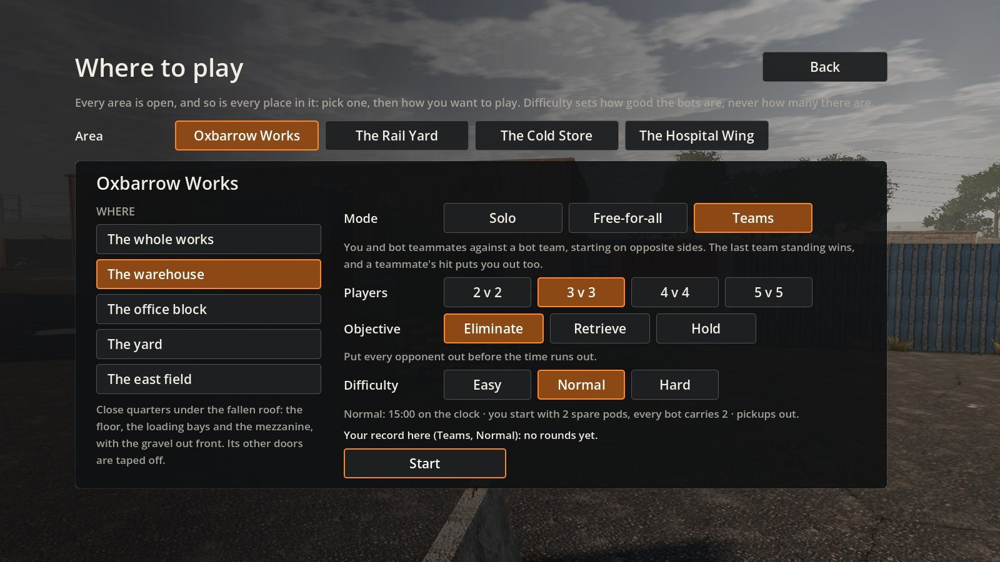
*Where to play: the four areas along the top, then where in Oxbarrow Works (here the warehouse), the mode, size,
objective and difficulty, and your record there.*

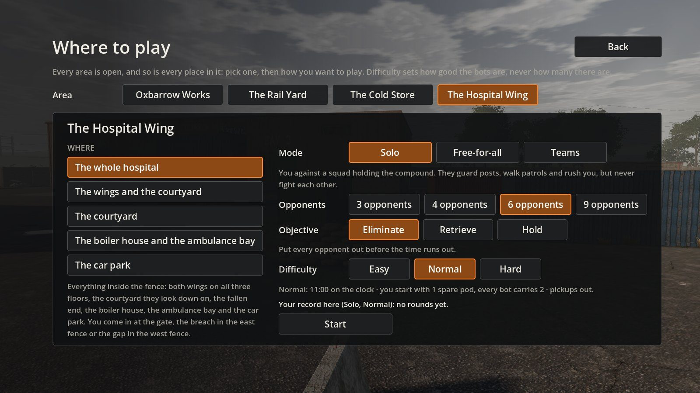
*The Hospital Wing's places: the whole hospital, the wings and the courtyard, the courtyard alone, the boiler house and
the ambulance bay, and the car park.*

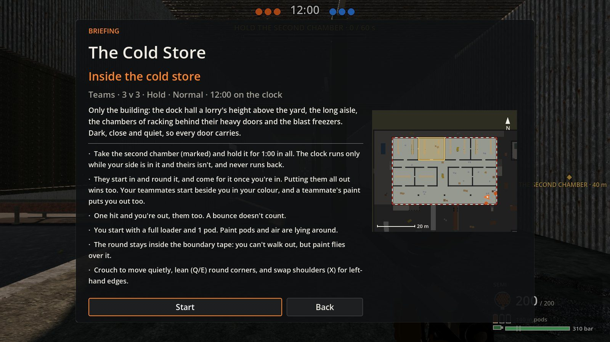
*A 3 v 3 hold inside the Cold Store: the map framed on the building, the room to hold marked, the edge taped.*

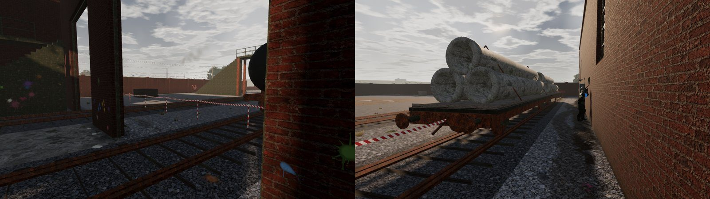
*The Rail Yard's engine shed: tape across the tracks outside its doors, and along the south side, tied off at a wagon.*

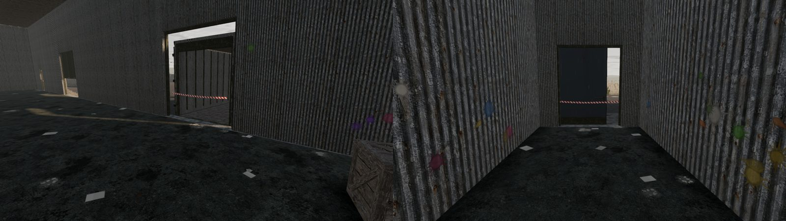
*Inside the Cold Store: a dock door and the east door taped off.*

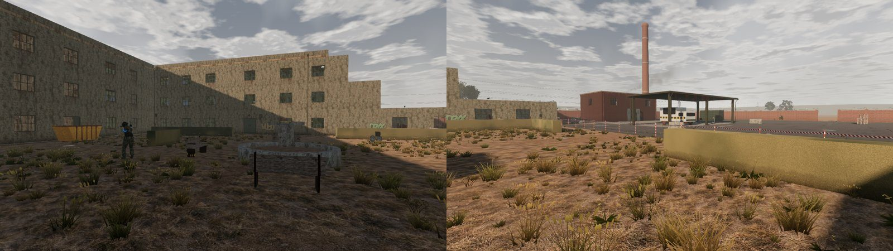
*The Hospital Wing's courtyard, its open side taped.*

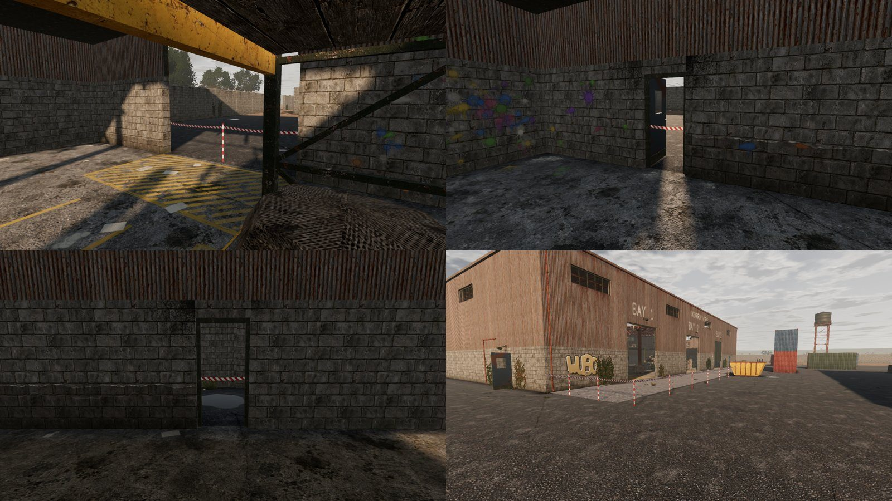
*Oxbarrow Works' warehouse: the east loading gap and the west and north doors taped off, and the gravel out front.*

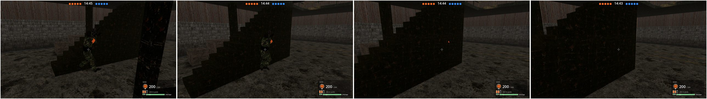
*Before: an opponent walking into the warehouse stairs from the side and disappearing inside the flight.*

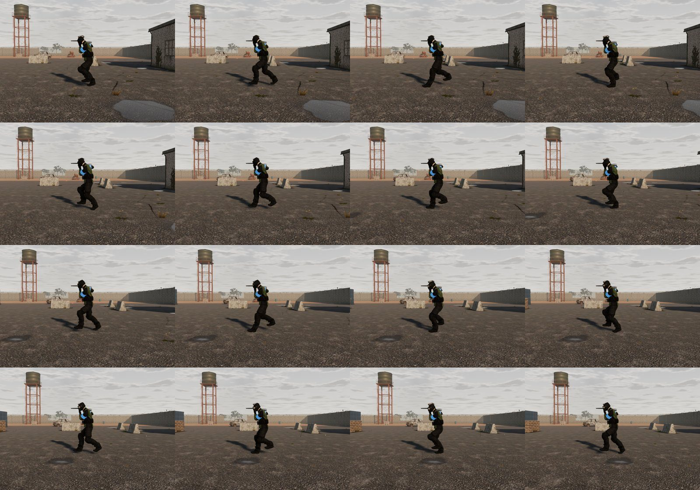
*Walking (3 m/s), a frame every tenth of a second: each foot planted until it steps, the marker shouldered.*

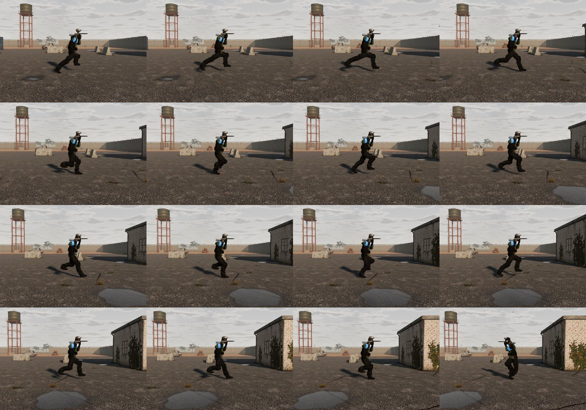
*Running (5.5 m/s): bent knees, long strides, and both feet off the ground between steps.*

**How to get it:** this is a pull request stacked on Phase 3's ([Tim-D-W101/Pb#4](https://github.com/Tim-D-W101/Pb/pull/4)):
merge that one into `main`, then this one. CI publishes each run's build as the test build, so once this pull request's
run has finished, `Play.bat` brings it the next time you start the game (until another pull request's run replaces it).

**Known issues from this round:**

- **No new clips:** Higgsfield's daily generation limit stopped them that day (no credits spent), and the planted
  steps cover every move without them. The voices came the next day ([below](#the-voices-2026-10-07)).
- **A place's edge is a rectangle,** so some parts take in a strip of a neighbour's ground (in Oxbarrow Works, the yard
  and the warehouse share the gravel in front of the bays), and a few doors on an edge are taped shut.

## More life in the opponents (M3.14)

You said the plan was OK and to go ahead, so the opponents got the rest of what M3.14 planned:

- **Looking round.** Standing about, they glance one way or the other every few seconds, and when something makes them
  turn (a noise, a shout, the next corner) the head goes first and the body follows. Their eyes are where their head
  looks, and the head and mask hitboxes turn with it, so what you see is still what you can hit; the marker stays on
  the aim.
- **On a post** they look one way, hold it, back to the middle, the other way, hold it, instead of a steady swing.
- **Standing still** the weight goes from one foot to the other every few seconds, and they breathe, harder just after
  a sprint.
- **Pulling up from a run**, the last step comes down short and the other foot follows at once, while they dip into
  their knees and tip on over their feet, then settle; no more feet catching up after the body has stopped.
- **Hit**, the flinch, then the marker up over the head and the other hand up, and they walk off like that, with "Hit!"
  over them (the voice comes with the recordings).
- **Behind low cover** their knees go out to the sides and their feet back, and their elbows tuck in, instead of
  sticking into the cover. Measured with `-- --cover-demo`: crouched at the low cover by Oxbarrow's guardhouse, the
  knees went 12.8 cm into it and the elbows 6.0 cm; now neither does. Out in the open on the Rail Yard, 4.0 cm of knee
  before, none now.
- **Where to play** shows a picture of the place you pick under the list of places, from one of its viewpoints; what's
  there now heads the right-hand column and Start sits beside your record, so the whole card fits on the screen.

The hands-up walk-off and the refill were going to be generated clips (8 credits each); built on the poser they keep
the planted steps and match the hitboxes, so no clips were bought. Everything is in the data (`presentation.jsonc`
`characters` and `steps`, `brain.jsonc`, `movement.jsonc` → `maxHeadTurn_deg`), and six new sim tests cover the head:
its hitboxes, its limit, that a bot sees where its head looks, glances when nothing's going on, looks at a noise before
its body comes round, and sweeps a post a look at a time.

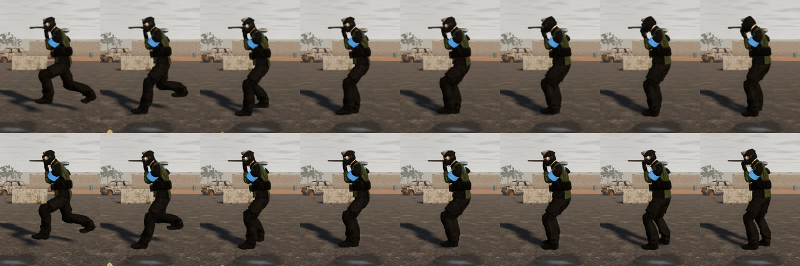
*Pulling up from a sprint, a frame every tenth of a second: before (top) the body stops upright and the feet catch up;
now (bottom) it dips into the knees and tips on, then settles.*

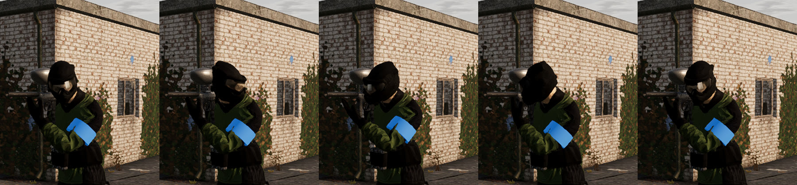
*Looking round: straight down the marker, a look towards you, back, a look away, back. The marker stays on the aim.*

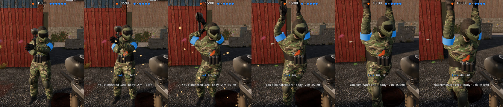
*Hit at 2 m: the ball breaks on the chest, the marker comes up over the head and the other hand goes up, and the walk
off starts.*

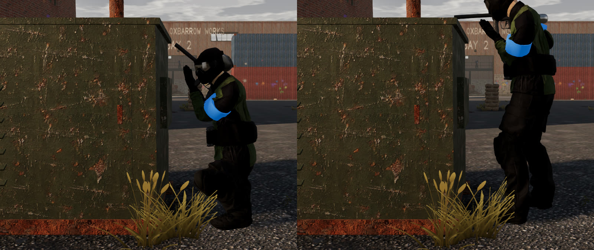
*Tucked in behind an electrical cabinet in Oxbarrow Works (`-- --cover-demo`): crouched tight to it, the knee stops at
its face and the marker is up off it; stood up, the marker goes over the top.*

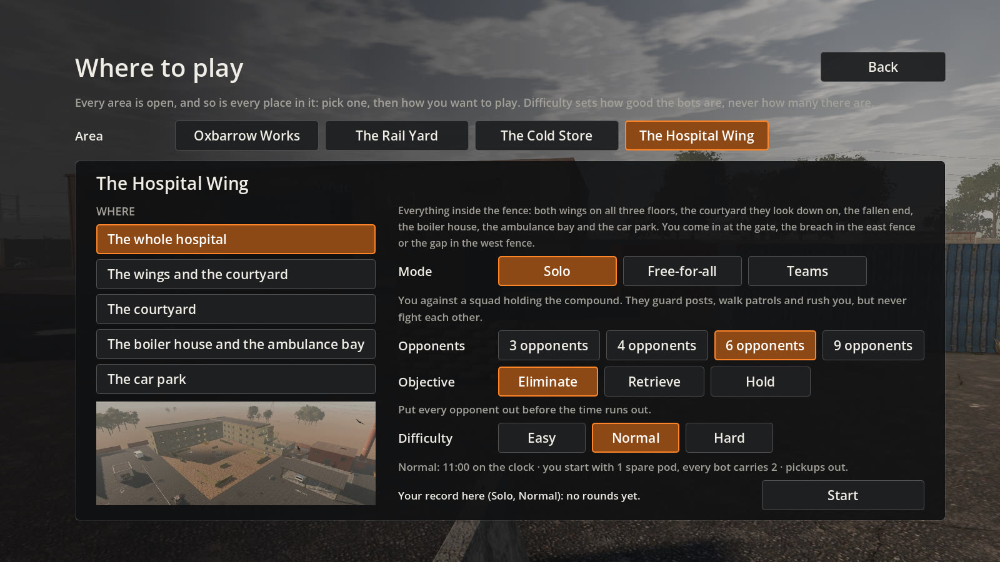
*Where to play: the place you pick, as you'd see it there, under the list; what's there at the head of the right-hand
column, and Start beside your record.*

## The voices (2026-10-07 and 08)

All seven voice takes are in: Knox and Reid for the first character model, Brooks and Gideon for the stocky one, Petra
and Maeve for the third, and Alistair as the referee (Higgsfield's Seed Audio, one take of each whole script; 25.7
credits for the 250 lines). Bots call out in their own voices, from where they stand, and the referee calls the round:
"Game on!", the time, "Hit! You're out.", the result. Five were made on 2026-10-07 and Gideon's and Maeve's on
2026-10-08, as a day allows five generations.

- **Every line listened to.** Each take was cut into its lines (the 39 callouts, or the referee's 16), and all 250 files
  were run through a speech recogniser and compared with their script line (`tools/art/voice-check.py`, new). Two had
  more in them than their words: Knox says "Where'd they go?" twice, and Reid says "Man down." again before "They got
  one of us!". The importer now takes `--keep-first="LINE"` and `--keep-last="LINE"` for that, keeping just the one
  part, cut at the pause between them, and the line's provenance record says so. Everything else says its words.
- **No next word at the end of a line.** Knox runs some lines almost together (30 ms apart), and the 90 ms kept after a
  line's last sound reached into the next line's first word. The cutter now never reaches past the cut either side;
  CI's art self-test checks that and the new part-keeping on its made-up takes.
- **In the game:** Oxbarrow's walk-through voices its callouts and the referee calls the round. The voices are 2.9 MB
  in all; the Windows build packs each voice on its own (the referee's 16 lines are a 288 KB pack), so `Play.bat`
  downloads each once.

Each take's provenance (job, voice, script, download) is in `game/data/assets.jsonc`.

## What was built

You asked to continue and build Phase 3, the level ladder from the roadmap you approved with Phase 2. All of it is in
but the recordings and the art above. *(Since 2026-10-06 the ladder is open areas, each with places: see above.)*

- **The ladder and the save** (M3.1). Four compounds of rising difficulty: Oxbarrow Works, then the Rail Yard, the Cold
  Store and the Hospital Wing. Winning any round on a level opens the next (the rule is data, in `levels/ladder.jsonc`,
  so it can be made stricter). The profile keeps what's open and, for each level, mode, difficulty and objective, your
  rounds, wins, fastest win, best accuracy and most eliminations, and your last choices. Level select shows what's
  locked and what opens it, and your record; the summary says when a round opened a level; the main menu's backdrop is
  the newest level you've opened. "Open every level" in the settings skips the climb.
- **Doors** (M3.2): hinged or sliding, single or double, in five kinds (panel, flush, steel, swing and cold-room),
  starting shut, open, ajar or at random each round. They're part of the sim: paint hits them and the splats move with
  them, they block sight, and they stop rather than push through someone in the way. F (on a pad, the refill button)
  opens or shuts the door you're facing; holding it eases the door open a little at a time, for a peek. Doors make a
  noise the bots hear, and the bots open the doors on their way.
- **Marksman and Flanker** (M3.3), and bots passing on what they see: a bot that spots you shouts, and teammates
  within earshot get where you are as a lead. A **Marksman** takes the best vantage near its start (every cover point
  is scored for its view when the level loads), watches its most open view, fires at range only once its aim has
  settled, and moves on after six shots or as soon as balls land round it. A **Flanker**, on a teammate's call, picks a
  spot that can shoot where you are from at least 50° off the line between you and the caller, out of your sight, by
  the way you'd see least of, and goes, calling "Flanking!". It holds its fire on the way unless you turn towards it,
  and at its spot it looks out before it searches.
- **Objectives** (M3.4), in solo and teams: **Retrieve** (find the case in its marked building and carry it out
  through a way in; it drops where its carrier is hit) and **Hold** (take a marked room and hold it for 60 s, which
  only counts while nobody else is in it). Putting the other side out still wins. Bots guard the objective and
  counter-attack, your bot teammates play it, and the HUD marks where to go.
- **Three new levels** (M3.5–M3.7), each playable in every mode, size and difficulty, with their own kit:
  - **The Rail Yard** (150 × 80 m, 779 primitives): four tracks with rakes of wagons you can shoot under but not crawl
    under, an engine shed with a gantry, a goods shed and platform, a signal box and a footbridge for the Marksmen.
  - **The Cold Store** (100 × 80 m, 859 primitives): a dock hall 1.2 m up, reached by ramps, steps or through the
    lorry trailers backed onto it; dark chambers behind eleven heavy doors; racking you can see through standing but
    not crouched; a plant room, offices and a weighbridge outside.
  - **The Hospital Wing** (110 × 80 m, 1,286 primitives): two three-storey wings in an L round an overgrown courtyard;
    wards with curtains you walk through but can't see or shoot through; a lift shaft open through every floor; a
    fallen end open to the sky; an operating theatre, a boiler house and an ambulance bay.

  The Rail Yard brought a navigation cost that would have hit every level (one search for a place on the gantry
  could take 60 ms); bots now search guided by eight landmarks per level, which keeps every search under a thousand
  steps.
- **Sound** (M3.8): 87 sounds in 225 variations, all synthesised when the game starts (no recordings): the marker's
  report sagging as the tank empties, breaks and bounces per surface, footsteps per surface and pace, slides and
  landings, doors per kind, the case and the room, the referee's horn and whistles, wind, traffic, crows and trains
  outside and a room's tone inside. Each sound plays from where it happened, dulled with distance and muffled through
  walls, with the reverb of the room you're in. The referee calls the round: "Game on!", the time warnings, the
  result. The voices (39 callouts in each of six voices, and the referee's 16 lines) are imported like the art, with
  their provenance, and a missing line shows as its subtitle.
- **Settings** (M3.9) in five tabs, the same in the main menu and the pause menu: every action rebindable (two
  keyboard-and-mouse bindings and one pad binding each, by pressing the new key, button or stick; a clash is shown,
  with an offer to swap), stick speed and curve, crouch and walk as hold or toggle, the graphics preset and each of its
  parts, window mode, frame cap, render scale and field of view, the five volumes, subtitles and their size, the
  crosshair's style, colour and size, the hit marker, head-bob, camera jolt, mask spray, HUD scale, and two
  colourblind-safe team colour sets.
- **Verification** (M3.11): a scripted demo of each new role (screenshots below), and a fix it showed was needed: a
  Flanker that reached its spot used to walk straight on towards you; now it looks out from the spot first, so a flank
  that worked ends in a shot from the side. Filming a won round through to its summary also showed the main menu never
  moved on from Oxbarrow Works behind it: the new levels had no camera drift for it, and now they do.

## Acceptance checks

| Check from the plan | Result | Evidence |
|---|---|---|
| Climb the ladder: win on each level to open the next; progress survives a restart | ✅ rules, ⏳ your play | Eleven ladder tests: only the first level is open at the start, a win opens the next and nothing else, a loss opens nothing, a stricter rule, records, per-objective records, "open every level", the file's round trip and a broken file. CI's bot match saves its round to the profile. Level select and the summary below. |
| Three new levels of rising difficulty, each playable in every mode, size and difficulty | ✅ | Level select; the level tests (every spawn, patrol point, pickup, case spot, way out and room reachable; fair starts for every mode, objective and size; bot rounds); in CI, a walk through each level and three bot matches on each. |
| Marksman and Flanker behave as described | ✅ | Eight behaviour tests; the role demos below, which CI also runs on the Rail Yard and the Hospital Wing. |
| Objectives: retrieve and hold can be won and lost by their rules | ✅ | Fifteen rule tests and four bot-round tests; CI's retrieve and hold bot matches on every level; HUD screenshots below. |
| Doors open and close for you and the bots, stop paint and sight | ✅ | Fifteen door tests; each level's walk-through in CI shoots a door, opens it and walks through; screenshots below. |
| Every event has its sound; callouts are voiced and come from the caller | ✅ | The [sound list](#sound-list); the walk-throughs check that shots, breaks, steps and doors were heard and the referee called the round, and Oxbarrow's voices its callouts. Every recorded line checked by speech recognition ([The voices](#the-voices-2026-10-07-and-08)). |
| Every action rebindable on mouse, keyboard and pad; colourblind-safe colours | ✅, ⏳ your play | Nine settings tests; CI's menu check finds the five tabs and a slot for every binding (111); screenshots below. |
| 10 people in one round at ≥ 60 fps on a GTX 1070-class GPU at Medium, on every level | ⏳ your PC | The sim's share stays within its budget on every level ([Performance](#performance)). |

### Tests

`dotnet test` runs **381 sim tests** (304 when this report was first written, 191 at the end of Phase 2), all green.
Against the plan's test table:

- **Profile and unlocks:** as in the table above, plus the shipped ladder opening in order and a rule naming a tier a
  level lacks failing to load. *(Since 2026-10-06 the record book's tests replace these: records by area, place, mode,
  objective and difficulty, a ladder save loading, every area and place open, and no unlock key accepted.)*
- **Places (M3.12):** every part of every area keeps only what lies inside it, reaches every spawn, case spot and room
  inside from each entry and nothing outside, and starts every mode, size and objective inside it, apart and on
  walkable ground; bad places are named by file and key; each has its own picture for the menu, from a viewpoint
  inside it.
- **The head (M3.14):** the head and mask hitboxes turn with it and the marker doesn't; the sim keeps it within 70°
  and straightens it once out; a bot sees where its head looks, glances round when nothing's going on, looks at a
  noise before its body comes round, and sweeps a post a look at a time.
- **Doors:** leaves hang where the files say; a shut door stops paint and sight and an open one doesn't; a tap swings
  the door you face and nothing else, holding eases it open; a door stops rather than swing into someone; opening and
  shutting make a noise a bot hears; bots open shut doors on their way, doors swinging towards them and doors standing
  ajar, and their paths go round a leaf standing open across the way; doors start the same from the same seed; moving
  doors don't allocate.
- **Marksman:** vantage ranks long, high views first; a Marksman takes a top-quarter vantage near its start and watches
  from it; a hard one puts a still target out at 42 m in a few careful shots; it moves on at least 8 m once balls land
  round it.
- **Flanker:** on a call it goes to a spot 58° off the line, along a way you see 70 % of against 100 % walking straight
  at you; coming round unnoticed, it looks out from its spot and opens up from there.
- **Shared contacts:** a shout reaches a teammate 9 m away and not one 70 m off; a call still counts after the
  teammate hears you, then goes stale.
- **Objectives:** the case starts where the seed says; your side picks it up and carrying it out wins, theirs can't
  pick it up; a carrier put out drops it and a teammate picks it up; a carrier can't sprint; time running out loses;
  holding alone for 60 s wins, contested time doesn't count and leaving doesn't lose what's held; free-for-all is
  always eliminate; defenders start round the objective; a bot in your slot fetches the case and carries it out, and
  takes the room and holds it; defenders come for the case and the room.
- **New levels:** every level loads and every place on it is reachable from every way in; starts are fair for every
  mode, objective and size; per level, the features that make it (the tracks and wagons, the trailers and racking,
  the hospital's floors, lift shaft, fallen end and curtains).
- **Settings:** a Phase 2 settings file loads, bad values are put right, an unreadable file gives the defaults,
  settings and bindings survive a reload, overrides apply over the defaults, a taken binding clashes and swaps.
- **Determinism and cost:** the same seed and inputs give the same round with doors and objectives; stepping
  allocates nothing with doors on the move or an objective round on.
- **Sound data:** every area's tone is known, every voice file is on record and every record's files are there.

CI also runs the game headless (`tools/ci/smoke-test.sh`): the menu (four levels, three modes, the settings' five tabs
and 111 binding slots), the range under a 1,000-ball stress test, a walk through each of the four levels (every flight
of stairs and every ramp, a slide, a jump, a door shot, opened and walked through, a duel each way, and every kind of
sound heard), fourteen bot matches (solo and free-for-all on every level, teams with retrieve or hold on every level),
the two role demos (the Marksman has to spot you and open up, the Flanker has to go round and look out from its spot),
and the art importer's self-test (including twelve made-up voice takes cut into their lines), all with zero sim
errors. The bot that plays your slot only sweeps the opponents' spawns, so it loses most of its rounds; the matches are
there to play whole rounds without errors.

## Performance

Sim cost per tick, Release build, on the 4-core cloud VM (`dotnet run -c Release --project tools/Pb.Bench`). The sim
ticks at 120 Hz, so twice per 60 fps frame; the budget is 0.5 ms a tick.

| Level | Primitives | Balls only | **10 players and about 1,000 balls** | p95 | Per 60 fps frame |
|---|---|---|---|---|---|
| Oxbarrow Works | 546 | 0.20 ms (979 balls) | **0.44 ms** (979) | 0.63 ms | 0.88 ms |
| The Rail Yard | 779 | 0.18 ms (988) | **0.40 ms** (988) | 0.59 ms | 0.81 ms |
| The Cold Store | 859 | 0.24 ms (860) | **0.41 ms** (971) | 0.60 ms | 0.81 ms |
| The Hospital Wing | 1,286 | 0.20 ms (978) | **0.40 ms** (978) | 0.60 ms | 0.81 ms |

Nine Hard bots' brains take 0.01–0.05 ms a tick in solo and 0.06–0.14 ms in a free-for-all, where each watches all the
others. Each level's navigation grid (224,000–301,000 places) and cover points (891–1,405) are built as it loads, in
0.6–0.7 s. The ten-player figure is up from 0.28 ms at the end of Phase 2: the sim does more now (doors, shared
contacts, objectives), and the shared VM varies from run to run.

In the game itself the sim runs about 12% slower than these figures, since the game's runtime has two JIT features
turned off (see [Fixed after the report](#fixed-after-the-report)).

Rendering was only measured under software rendering in the cloud container, which shows what's drawn but not how
fast.

## Your check

About ten minutes, on the latest test build (`Play.bat` updates it):

1. **Where to play.** Every area is open on a first run. Pick one, then a part of it (the engine shed, say): the round
   stays inside the tape. Play a round, and your record there shows under the difficulty when you come back; quit and
   restart, and it's still there.
2. **The frame rate.** On the Medium preset (F12 cycles them), with v-sync off (F8), start the **Hospital Wing** as a
   **Free-for-all** with **10 players** and press **F4** for the performance overlay. The target is **60 fps or more at
   1080p**. The Hospital Wing has the most to draw; the Rail Yard the longest views.
3. **The new opponents.** Solo on the Rail Yard (Marksmen on the signal box, the footbridge and the gantry) and the
   Hospital Wing (Marksmen at the top-floor windows over the courtyard, Flankers in the stairwells). Press **F3** to see
   what they think.
4. **The sound.** Shots across the yard, a door slamming in the next room, footsteps on metal stairs, wind outside and
   the hum inside, and the bots' callouts and the referee in their voices.
5. **The settings.** Rebind something on the Controls tab and try a colourblind team colour set (Accessibility).

If the frame rate is short, the levers are, in order: render scale (Video), then Medium's weeds and shadows. Please
tell me your GPU and the figures, and how the Marksmen and Flankers feel.

## Sound list

Every sound is synthesised in `game/audio/SoundBank.cs`, several variations each; `-- --sounds=DIR` on the art tool
writes them all out as WAV files.

| Group | Sounds |
|---|---|
| Your marker | the report at full, half and low tank pressure; the loader feeding; dry fire; fire-mode switch; low-air warning; refill (pod pop, pour, snap, nothing left); picking up a pod or air |
| Breaks | on stone and brick, metal, wood, glass, ground, gravel, tarp, inflatables, rubber, a person, a mask |
| Bounces | off hard surfaces, metal, wood, glass, soft things |
| Feet | steps on stone, metal, wood, gravel, ground, grass, tarp, water and rubber; slides on hard ground, soft ground, metal and gravel; jumping; landing hard, soft and on metal |
| Doors | a hinge's creak and a slam; a steel door's opening and clank; swing doors opening and flapping; a cold-room door's seal and thud; a sliding door's roll and bang |
| You | being hit; the hit marker |
| Objectives | the case taken, dropped and out; its beep and alarm; the room held, contested and lost |
| The round | the breakout horn; the referee's long whistle, triple whistle and pips |
| Menus | click, hover, toggle, back, reward |
| Ambience | wind; distant traffic; room tones (room, hall, dripping water, pigeons, draught, cold, hum); crows cawing and wings flapping; trains passing |

The voices: 39 callouts in each of six voices (two per character model), from "Contact!" and "Flanking!" to "They're
in the room!", and the referee's 16 lines ("Game on!", "One minute left!", "Hit! You're out.", "Room held! Round over."
and so on), recorded on 2026-10-07 and 08 ([The voices](#the-voices-2026-10-07-and-08)).

## Higgsfield spend

38.45 credits so far in Phase 3: five voice takes on 2026-10-07 (17.9: 3.9 for a take of the 39 callouts, 2.3 for the
referee's 16 lines), and the last two takes and the three texture sheets on 2026-10-08 (20.55: 4.25 a sheet). 196.42
credits are left. The plan allows up to 150:

| Item | Credits |
|---|---|
| Voices: seven takes of the scripts (done) | 25.7 |
| Three texture sheets, twelve materials (done) | 12.75 |
| Up to four generated props (one picture of six, then Tripo H3.1 at 18 each) | ≈ 77 |
| **Phase 3** | **≈ 115, 38.45 spent** |
| Phase 2's leftovers (four props and the crouched walk), approved with Phase 2 and made on 2026-10-06 by its own check-in | 80 |

At five generations a day, Phase 3's share is about three days of generations: five voices on 2026-10-07, the last
two and the three texture sheets on 2026-10-08, then the props (a picture of six, then up to four models).

## Screenshots

These were rendered in the cloud container with Mesa's software Vulkan, so the look is right but frame rates mean
nothing. All the shots from the phase are in [phase-3/](phase-3/), named by milestone; the bot overlay (F3) is on in
the role demos: sight cones coloured by how alarmed each bot is, paths in blue, the cover a bot is making for in white,
and over each bot its state and its detection meter.

**The ladder:**

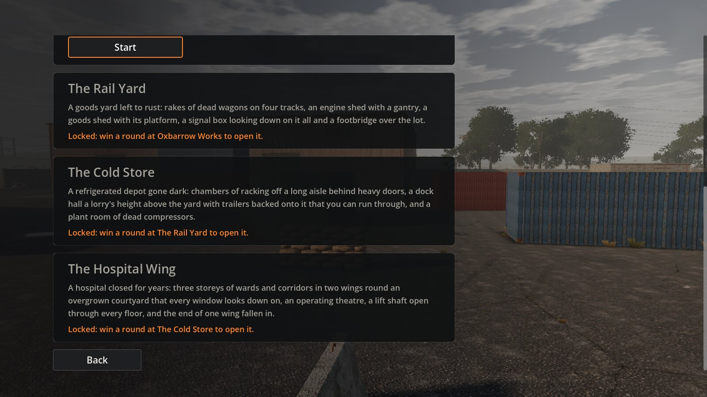
*Level select on a new profile, scrolled down: only Oxbarrow Works is open (its Start button at the top), and each
locked level says what opens it.*

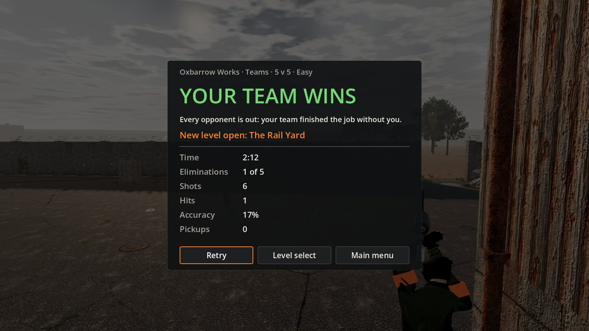
*The summary after a real win on Oxbarrow Works (a 5 v 5 team round on Easy, played by the bot in your slot and its
teammates, filmed to its end with `--fast --show-summary`): "New level open: The Rail Yard".*

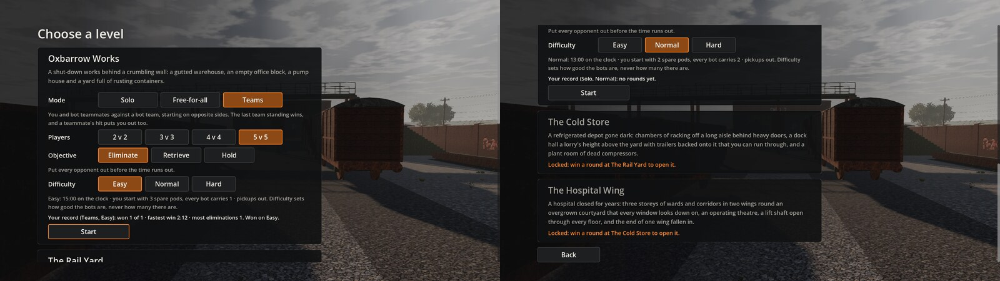
*Level select afterwards, on that round's choices (Teams, 5 v 5, Easy): Oxbarrow Works shows the record (won 1 of 1,
fastest win 2:12, most eliminations 1, won on Easy); further down, the Rail Yard is open and the Cold Store and the
Hospital Wing still say what opens them.*

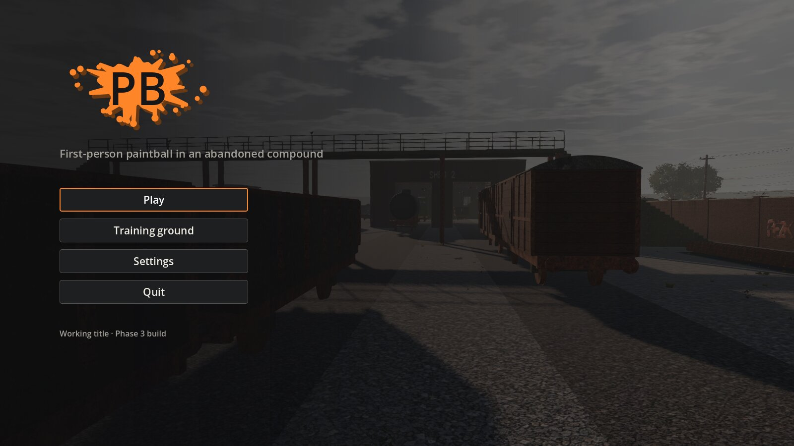
*The main menu then shows the newest level you've opened behind it: the Rail Yard, down the lane between the wagons.*

**The three new levels:**

*The Rail Yard: the goods shed and its platform, the yard office, stacks of sleepers and rails, the engine shed and
the rakes of wagons beyond.*

*Between the rakes of wagons, under the footbridge, with an opponent on patrol.*

*The Cold Store: the store with its dock and trailers, the offices, the gatehouse and the weighbridge.*

*Through a trailer backed onto the dock: a tunnel from the yard up into the dock hall.*

*In a cold chamber: racking you can see through standing but not crouched, and a dead forklift.*

*The Hospital Wing: the two wings round the overgrown courtyard, the boiler house and its chimney, the ambulance bay
and the car park.*

*The courtyard that every window looks down on, with its hedges (still plain boxes until their texture comes).*

*The fallen end of the north wing, its floors breaking off into the sky.*

**The new opponents** (`-- --role-demo`):

*A Marksman at its vantage on the Rail Yard: the signal box's glazed operating floor (right), watching the yard.*

*You step out 40 m down its view; from the back of the signal box, it has spotted you and opens fire.*

*On the Hospital Wing, an opponent spots you down the waiting room and calls it (its sight cone has gone red).*

*The Flanker, out through the building and across the courtyard to a spot off to your side, the white line to the
cover it's making for.*

*At its spot behind the skip it looks out over it, towards the wing you're in, before it searches (beside it, a
teammate already in the fight).*

**Doors, objectives and settings:**

*Swing doors with their vision panels in the office block.*

*Retrieve: the case and its marker.*

*Hold: the room contested, its clock stopped.*

*Settings → Controls: every action, two keyboard-and-mouse bindings and a pad binding each.*

*Settings → Accessibility: the team colours (the standard set or one of two colourblind-safe sets), HUD size and
"Open every level".*

## How to run

- **Play on Windows:** download [Pb-windows.zip](https://github.com/Tim-D-W101/Pb/releases/download/test-build/Pb-windows.zip),
  unzip it and run `Play.bat`; it keeps itself up to date. **Play**, pick a level, a mode, a size, a difficulty and
  (in solo and teams) an objective, then **Start**.
- **From Godot 4.7.2 .NET:** open `game/project.godot` and press F5.
- **Controls and debug keys** are in the [README](../../README.md#controls); every binding can be changed in
  Settings → Controls.
- **Without Godot:** `dotnet test` for the sim tests, `dotnet run -c Release --project tools/Pb.Bench` for the
  benchmark.
- **Scripted views** (how these screenshots were made): `-- --shots` tours a level's viewpoints, `-- --role-demo=marksman`
  or `=flanker` shows a new role at work, `-- --objective-demo`, `-- --round-tour` and `-- --menu-tour` show the
  objectives and the screens, and `-- --bot-match` lets a bot play your slot (see [CLAUDE.md](../../CLAUDE.md) for the
  full list).

## Fixed after the report

- **The Windows build crashed on the main menu on your laptop** (2026-10-05). The cause was a fault in the .NET 8
  runtime's code generator on Windows x64. In a big method with loops whose local functions capture variables (here
  `Cracks.Build`, run while the menu builds the level behind it), code the runtime optimises in the middle of a loop
  loses track of the captured objects when the garbage collector runs. The game then hits a `NullReferenceException`,
  as your log showed, or a fatal access violation that closes it without a word in the log. It never happens on Linux,
  which is why CI and my runs missed it. It was reproduced with a copy of the crack builder on the Windows runtime
  (8.0.31, under Wine, with a collection every 64 KB): it failed within 10 to 50 builds every time, and never in 800
  with either of two JIT features off. The Windows build itself, run the same way, hit your exact exception in 1 of 5
  level loads before the fix, and in none of 24 after it. The game now runs with both off (`game/Pb.csproj`): quick JIT for loops (a method with
  loops starts unoptimised and is optimised in the middle of a loop) and dynamic PGO (optimising by profiles taken as
  the game runs). The sim pays about 12% for it: 0.34 ms a tick with ten players,
  against 0.31; the budget is 0.5 ms. The log's first lines now say whether the switches are on
  (`.NET 8.0.31: TieredPGO=false, QuickJitForLoops=false`), and the Windows build fails in CI if an export loses them.
  Two smaller fixes came with it: a piece of the menu's backdrop that fails is now left out instead of being built
  again every frame, and the log is written line by line, so a crash can't swallow its last lines.

## Known issues and limitations

- **The frame rate is unchecked on a real GPU.** Everything here was rendered in software; your check above is the one
  that counts. The Hospital Wing is the heaviest level to draw.
- **The new levels' props aren't generated yet** (M3.10): they're the detailed models built in code until the next
  days' generations. A few new materials keep a tinted Phase 2 photo (grey wagon steel, the shunter's green, sooty brick,
  the white cladding and trailers, the render) or the drawn look (the ammonia tanks, curtains, mattresses, the
  ambulance, steel doors). The Phase 2 session's four props and crouched walk are in its own PR,
  [Tim-D-W101/Pb#5](https://github.com/Tim-D-W101/Pb/pull/5).
- **Flank spots are scarce indoors.** A Flanker needs cover that is hidden from you yet has a shot at where you were;
  inside the hospital and the cold store there often isn't one, and then it comes to help like anyone else. The call
  also only says roughly where you are (give or take 2.5 m), so even a good spot can miss you, and then it searches
  from there.
- **Team colour changes apply from the next round**, and the pause menu's settings panel is wide (900 px).
- **Bots** still don't jump, slide or climb anything but stairs and ramps. The bot that plays your slot in CI only
  sweeps the spawns, so it loses most rounds.
- **Oxbarrow Works' rear-alley patrol** passes within sight of its north-east way in; a round starting there can open
  with a fight.

## Deviations from the plan

- **Sound effects are synthesised, not generated:** Higgsfield's audio tools only make speech, as the plan expected.
  The recipes are physical sketches in code, so every sound is data-driven and nothing is a recording but the voices.
- **One take per voice, not one generation per line:** each voice's 39 lines are read in one take and cut into a file
  per line at its pauses (`VoiceSplitter`), so the seven voices cost seven generations instead of about 250.
- **The hospital's wings are generated by a script** (`tools/levels/hospital_wings.py`), since their walls, doors and
  furniture repeat floor by floor; the script is the source.
- **Bot navigation got landmarks** (not in the plan): a fix the Rail Yard needed and every level gained from.
- **A Flanker looks out from its spot** before searching: a change to M3.3's behaviour, made in M3.11 after the demo
  showed what it did without it.

## What's next: Phase 4, multiplayer

From the [revised roadmap](../phase-2.md#revised-roadmap): up to ten players, co-op against bots on the compound levels
and player against player. The sim was kept ready for it: doors, objectives and the profile's choices all go through
the same commands and events, and the bots send the same commands as players.

Before that, over the next few days: the new levels' generated props, pushed as they're imported, with this report
updated.

**Useful from you:**

- your frame rate and GPU, from the check above;
- how the Marksmen and Flankers feel on each difficulty, and whether the places are the right ones (each is a
  rectangle in the level file, quick to move);
- whether a fifth level is wanted before multiplayer.
