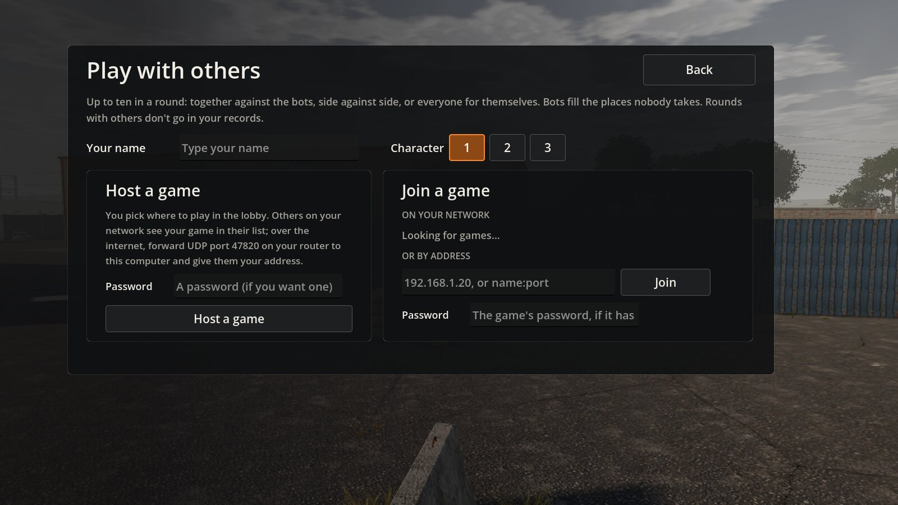
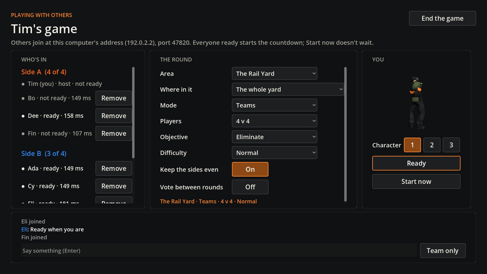
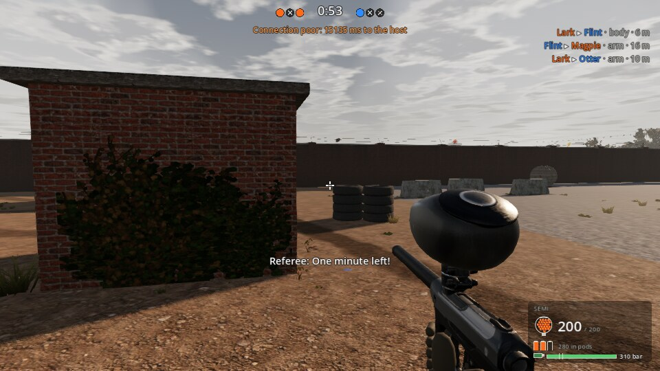
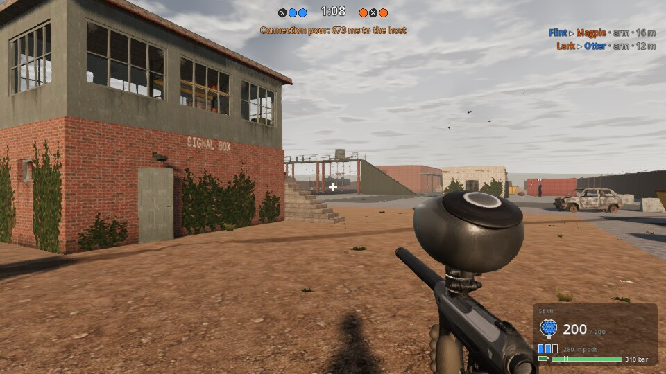
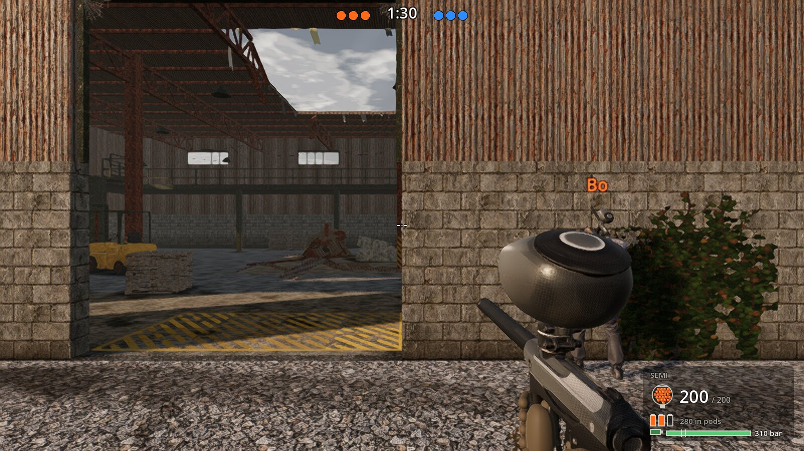
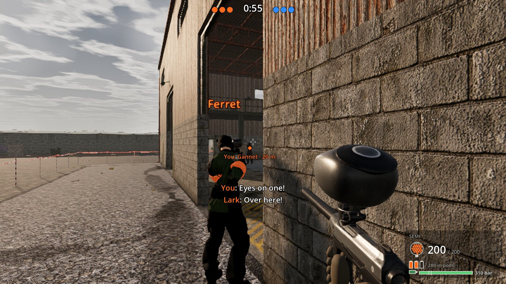
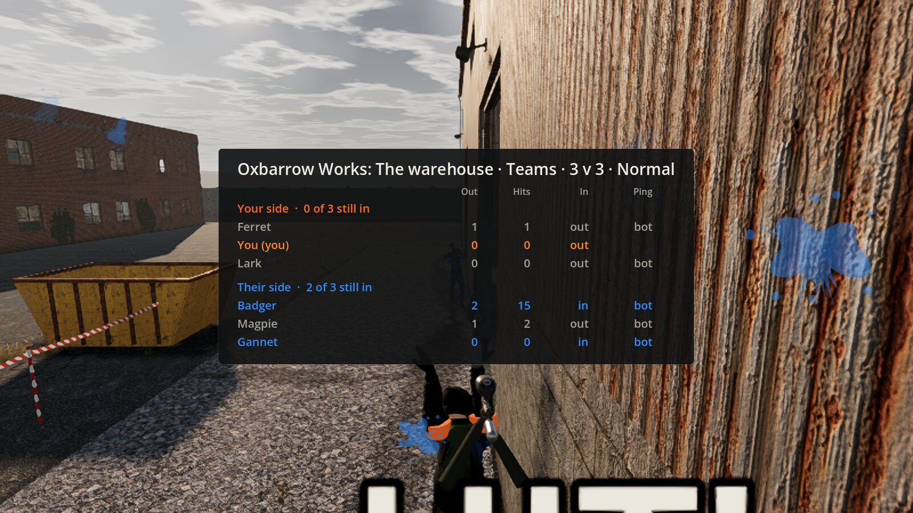

# Phase 4 report: multiplayer

**Date:** 2026-10-09 · **PR:** [Tim-D-W101/Pb#8](https://github.com/Tim-D-W101/Pb/pull/8), every CI job green.
**Status:** finished and tested. One thing is left: **your check**, a round with friends or two copies on your PC (see
[Your check](#your-check)).

Up to ten people now play together:
- in co-op against the bots, as two sides, or everyone for themselves;
- hosted from the game, or on a dedicated server;
- on your network, or over the internet.

Bots fill the places nobody takes. Every copy predicts its own player and is corrected by the host, and every copy
ends a round with the host's result, to the shot.

The plan is [phase-4.md](../phase-4.md), with an as-built note for each milestone. The technical design is
[architecture §16](../architecture.md#16-phase-4-multiplayer). Hosting, step by step, is [hosting.md](../hosting.md).

## What was built

- **Rules for several players** (M4.1):
  - rounds have sides instead of one "hero", and each player reads the result from their own side;
  - starts keep a side together and away from the other;
  - in objective rounds the sides take turns to attack, round by round;
  - lag compensation is in the sim: a ball is checked against where its shooter saw the target, up to 200 ms back;
  - a joining copy has its own step.

  Rounds alone are unchanged.
- **The network core** (M4.2, `src/Pb.Net`, no engine):
  - bit-packed messages, and snapshots sent as differences from the last one each player confirmed;
  - events resent until they're confirmed;
  - the server's queue of each player's commands;
  - prediction with replay, and interpolation of everyone else;
  - an in-memory network and a lag simulator.

  Whole networked rounds are tested without the engine.
- **Host and join** (M4.3), over UDP (Godot's ENet):
  - the host runs the round, and the briefing waits until every copy has built the level;
  - a joining copy predicts your own moves, and the host puts them right when they differ;
  - everything else comes from the host: the others, balls, sound, splats, voices and the HUD;
  - someone who drops out mid-round counts as out, and if the host leaves, everyone is told.
- **The lobby, the menus and the HUD** (M4.4):
  - **Play with others** in the main menu: your name and character, hosting (with a password if you like), and joining
    a game on your network, by address, or one you joined before.
  - **The lobby:**
    - sides that keep themselves even;
    - the host's choices of area, place, mode, size, objective and difficulty, and the map vote;
    - ready-up and the countdown, and text chat;
    - your character turning in your colour, and the host removing someone;
    - between rounds, everyone's summary and the session's score.
  - **In a round:**
    - names over teammates, and the scoreboard on Tab with pings;
    - a warning when your connection is poor;
    - chat on T (Y for your side);
    - the callout key (Z): it marks the opponent you're looking at for your side, and your bot teammates act on it.
- **The dedicated server** (M4.5):
  - the game started with `-- --server` runs headless and plays the rounds in `server.jsonc` in turn;
  - its log covers who joined, left or was turned away and why, each round and each player's connection, and anything
    it dropped;
  - every test build publishes it for Linux (`Pb-server-linux.tar.gz`) and Windows (`Pb-server-windows.zip`), and both
    bring themselves up to date before each start;
  - [hosting.md](../hosting.md) takes you through:
    - your network;
    - port forwarding and the firewall;
    - a server on your PC;
    - a rented Linux machine, started with the machine and updated by a restart.
- **The platform layer** (M4.6):
  - the game asks one interface who you are (your name, and an id kept in your profile) and what games there are to
    join;
  - the offline version is in now, and a platform's own (Steam, for crossplay) can stand in later;
  - the host knows you by that id when you come back, and gives you your session score again.
- **Verification** (M4.7): CI's networked rounds, the Windows build joining the Linux server under Wine, the network
  benchmark, and this report (below).

Along the way, M4.7's screenshots showed the lobby's chat pushed off the bottom of the screen once more than a few
people were in. The list of people now scrolls in its column, and the chat always stays on screen.

Then a CI run, on a busier machine than the one I test on, found three faults that only show on a slower computer or
after a longer wait. All three are fixed; the first and the last have tests that fail without the fix:

- **Dropped between rounds.** The server went on dropping anyone it hadn't heard from for 5 s after a round was over.
  Sitting in the lobby after a round put you out of the game. Silence now counts only while a round is being played.
- **A slow level build.** A copy can't answer while it builds a level, and the connection gave up after 20 s; one of
  CI's copies took longer. It now waits a minute (`net.jsonc`). In a round, 5 s of silence still drops someone.
- **Shut out after a stall.** A command more than 2 s ahead of its turn was thrown away. Once a copy got that far ahead,
  everything it sent after was thrown away too, for the rest of the round. A host stalling for over 2 s would have done
  that to every player. The server now skips on to such a command and never runs the ones in between: a stall costs a
  moment, and running fast still gains nothing.

## How to play with others

- **Two copies on one PC:** start the game twice: Play.bat, then Pb.exe in the same folder.
  1. In one, Play with others → Host a game.
  2. In the other, Play with others: the game is in the list.
  3. Both Ready (or Start now in the host's).
- **Friends on your network:** the same; your game is in their list.
- **Friends over the internet:** forward UDP port 47820 on your router to your PC, and give them your internet address
  ([hosting.md §2](../hosting.md#2-over-the-internet-from-your-pc)).
- **A dedicated server:** Pb-server-windows.zip from the
  [test-build release](https://github.com/Tim-D-W101/Pb/releases/tag/test-build): unzip it, then double-click Server.bat.
  Or the Linux one on a rented machine ([hosting.md §4](../hosting.md#4-a-dedicated-server-on-a-rented-linux-machine)).
- **A pretend bad connection:** Settings → Gameplay → Pretend lag, then join.

## Acceptance checks

| Check from the plan | Result | Evidence |
|---|---|---|
| Listen server: host from the game, others join | ✅, ⏳ your play | Real UDP rounds with two and three copies; CI's menu check finds Play with others; screenshots |
| Dedicated server on Linux and Windows | ✅ | CI's networked rounds each push, on the dedicated server; the packaged Linux server served a round to packaged joiners; the published package downloads, updates and serves ([below](#the-dedicated-server)); the Windows build ran under Wine |
| Lobby: create and join, sides with auto-balance, loadout preview, ready-up, map vote, countdown | ✅ | Ten lobby tests; the lobby screenshot below, with seven in |
| 10 players in a round | ✅ | CI's networked rounds fill to ten (five people and five bots) |
| Hits feel fair at 100 ms simulated latency | ✅, ⏳ your play | The lag compensation test: leading a runner at 20 m hits as often at 100 ms as next to the server (within 5 points) |
| No score desync | ✅ | CI compares every copy's result, scores and stats with the server's, every round |
| Server rejects over-rate fire | ✅ | The validation tests; in CI, "Trigger" flips its trigger every tick and fires at most 10.2 a second against the 10.5 cap |
| Co-op against bots and player vs player on every area | ✅ | CI's networked rounds: teams on Oxbarrow Works, free-for-all on the Rail Yard, co-op on the Cold Store, teams with retrieve on the Hospital Wing |
| 60 fps on Medium with ten in an online round | ⏳ your PC | The server's tick is within budget ([Performance](#performance)); only your hardware can show the frame rate |

### Tests

`dotnet test` runs **418 sim tests** (412 at the end of M4.3) and **64 network tests**, all green. Against the plan's
test table:

- **Rules for several players:** co-op, teams and free-for-all with 1–10 people end with the right side winning, read
  from every player's side. The named side attacks; starts keep a side together and away from the other; a person
  dropping out counts as out; rounds alone are unchanged.
- **Messages:** every message survives packing and unpacking; positions come back within 2 mm and angles within
  0.01°; a snapshot difference applied to its base gives the snapshot. The hello now carries who you are, and a copy of
  the last version is still told to update.
- **Loss and order:** with 5% loss, duplicates and reordering, every event arrives once and in order, lost commands
  come back from the repeats, and an older snapshot never overwrites a newer one.
- **Prediction:** at 100 ms your predicted position matches the server's on every tick of a scripted walk, run, jump,
  slide, climb and lean; after a forced correction it's back on the server's path at once.
- **Interpolation:** no stalls under 30 ms of jitter; a lost snapshot is bridged.
- **Lag compensation:** at 100 ms a shooter leading a runner hits as often as at 0 ms; the ball is checked against where
  the shooter saw the target; the rewind never passes 200 ms.
- **Validation:**
  - a trigger flipped every tick fires no more than the cap, never with an empty loader;
  - twice the commands move no faster than the rules, and are merged and logged;
  - after a stall longer than the queue reaches, a player's latest commands run at once, and a copy running twice as
    fast as a struggling host still plays, gaining nothing;
  - bad angles and unknown buttons are clamped and logged;
  - names lose control characters, and the host's log hears who was turned away and why.
- **No desync:** after a networked round every copy's result, scores and stats equal the server's.
- **Lobby:**
  - joining, leaving, sides and their balance, ready-up and the countdown;
  - the vote, chat and removing someone;
  - the session score, kept for someone who comes back (not for a second copy with the same id);
  - nobody dropped for silence between rounds, after the summary or when the host leaves a round early;
  - another version refused with a message saying which.
- **The dedicated server:** casting without bots, and the shipped `server.jsonc` naming only areas, places and modes the
  game has.
- **Cost:** a second of network ticks allocates nothing: the server and two copies, one with lag, jitter and loss.

CI also runs, on every push:

- **The smoke tests** (27 runs, as in Phase 3, now with the menu's Play with others).
- **The networked rounds** (`tools/ci/net-round.sh`, below).
- **The Wine join** (`tools/ci/wine-join.sh`).
- **The benchmark.**

### CI's networked rounds

A headless dedicated server and five headless players play four rounds over real UDP, one on every area and in all
three modes, with bots filling to ten. Each player has a bot at its controls, which sends its commands through the
network as you would.

| Player | How it plays | What the server must do |
|---|---|---|
| Ada, Bo, Cy | fairly, at 100 ms round trip with 10 ms jitter and 1% loss | end every round with the same result on their copies as its own |
| Trigger | flips its trigger on every tick, and refills when it runs dry | hold it to the fire cap |
| Clock | runs its ticks twice as fast, sending twice the commands | let it move no faster than the rules allow, and log it |

The job fails on any error, any copy whose result differs from the server's, more than 25 KB/s sent to a player while
a round is live, a shot rate over the cap, or no log of the fast clock.

In the last runs:
- every copy matched the server in every round;
- players were sent 6–14 KB/s;
- Trigger fired up to 10.2 balls a second against the cap of 10.5, and never over it; its round averages include its
  refills;
- Clock's commands were run two to a tick and logged every ten seconds.

Honest joiners were corrected 0–20 times a round. Some corrections were tens of centimetres, after a lost or late
command, when the server had run a stale one.

### The dedicated server

The packaged Linux server was tested three ways:

- **A round with two packaged joiners** (100 ms, jitter, 1% loss):
  - every copy printed the server's result;
  - it turned away a copy of another build, with the message telling them to update;
  - it peaked at about 200 MB of memory and sent each player about 7 KB/s.
- **Its update script, against a pretend release:** it updates and keeps an edited `server.jsonc`; when the release
  can't be reached, it starts the version it has.
- **The published package:** downloaded with the guide's command, it reports that it's the newest and serves as the
  same build as the game on the release.

The packages are 64 MB (Linux) and 74 MB (Windows).

### Windows under Wine

The exported Windows build plays a round on the packaged Linux server under Wine 9.0, in CI, and ends it with the
server's result and no errors. It also showed something only cross-platform play has: see
[Known issues](#known-issues-and-limitations).

## Performance

Release build on the 4-core cloud VM (`dotnet run -c Release --project tools/Pb.Bench`, "Network").

**The server's tick, ten players (nine joined over the in-memory network) and about 1,000 balls in the air:**

| Area | Step, mean | p95 | Packing for nine, mean | p95 |
|---|---|---|---|---|
| Oxbarrow Works | 0.36 ms | 0.48 ms | 0.029 ms | 0.075 ms |
| The Rail Yard | 0.34 ms | 0.46 ms | 0.029 ms | 0.081 ms |
| The Cold Store | 0.40 ms | 0.54 ms | 0.033 ms | 0.092 ms |
| The Hospital Wing | 0.33 ms | 0.43 ms | 0.027 ms | 0.074 ms |

- **The step:** within the sim's 0.5 ms a tick.
- **Packing:** what the network adds for nine players is a tenth of that.
- **Traffic with 1,000 balls:** the impacts fill every packet to its 1,100-byte budget (67 KB/s each), and events
  wait their turn.
- **Traffic in a real round:** with all ten firing at the cap, each player is sent 11–12 KB/s, within the 25 KB/s
  budget. The architecture estimated 13.

**A correction's replay:**
- **In the sim:** 12 ticks (the round trip at 100 ms) take 0.003 ms.
- **In the game,** with the engine's collide-and-slide for each tick, joining copies measured 0.3–0.8 ms for a typical
  correction of about 20 ticks.
- **How often:** a fair joiner is corrected a few times a minute.

**Memory and traffic of the dedicated server:** about 200 MB, one core, and about 7–12 KB/s to each player.

Rendering was only tried under software rendering in the cloud, where a copy runs at a frame or two a second. That shows
what's drawn, not how fast: the 60 fps check is yours.

## Your check

About fifteen minutes, on the latest test build (Play.bat updates it):

1. **Two copies on your PC.** Start the game twice (Play.bat, then Pb.exe in the same folder).
   - In the second copy, Settings → Gameplay → Pretend lag **100 ms** first.
   - In the first copy, Play with others → **Host a game**. In the second, Play with others: your game is in the list.
   - In the host's lobby pick an area, Teams, 5 v 5, and both press **Ready**.
2. **Hits feel fair.** Play the second copy (the one with the lag) against bots and the first copy's player:
   - shots that look like hits should be hits;
   - your own movement should feel as it does alone, with no rubber-banding.
3. **Everyone sees the same score.** Hold **Tab** in both copies during the round, and compare the summaries after it.
   Back in the lobby the session's score is the same in both.
4. **The frame rate.** In a copy, press **F4**: with ten in the round (bots fill the places) on the **Medium** preset,
   the target is **60 fps or more** at 1080p.
5. **Talking.** Press **T** to chat, **Y** for your side only, and **Z** while looking at an opponent to call them out
   (a mark and a shout for your side).
6. **With friends** (optional): [hosting.md](../hosting.md), from your PC or with the dedicated server. They need the
   same version, so all of you update with Play.bat first.

Please tell me how the lag felt, your GPU and the frame rate, and anything about the lobby that got in the way.

## Screenshots



*Play with others:*
- your name and character;
- hosting, with a password if you like;
- the games found on your network, an address to type, and the ones you joined before.



*The lobby with seven in, seen by the host:*
- each side with its people, their pings and whether they're ready, and the bots making up the numbers;
- the host's choices for the round;
- you and your character;
- the chat.

With more people than fit, the list scrolls and the chat stays.




*One round on the Rail Yard from two players' screens. Ada (orange) and Bo (blue) are on opposite sides, each joined to
the dedicated server:*
- each sees their own side on the left of the score bar, and their teammates named in their colour;
- the kill feed, the timer and the referee are the same for both.

Both copies ran under the software renderer at a frame or two a second, far slower than real time. So each warns that
its connection is poor: the warning working as it should.



*Bo, a teammate, named over their head in the side's colour.*



*The callout: you said "Eyes on one!" looking at Gannet, 20 m off; the mark shows your side where, and Lark, a bot
teammate, answers.*



*The scoreboard on Tab: each side, with who each player put out, their hits, whether they're still in, and pings
(bots marked).*

## How to run

```bash
dotnet test                                                    # 418 sim tests and 64 network tests
tools/ci/net-round.sh godot                                    # CI's networked rounds, on one machine
godot --headless --path game -- --server                       # a dedicated server from the source
godot --path game -- --host --name=You                         # host from the command line (the menu does the same)
godot --path game -- --join=127.0.0.1 --name=Friend --net-lag=100
dotnet run -c Release --project tools/Pb.Bench                 # the benchmark, with its Network section
```

CLAUDE.md lists every flag for playing with others.

## Known issues and limitations

- **Windows players on a Linux server are corrected more often.**
  - **What it is:** the walking physics (Godot's engine code) comes out a little differently on Windows and on Linux.
    So a Windows copy's prediction drifts from a Linux server's: 77–487 corrections a round under Wine, against a
    handful on the same system.
  - **How it shows:** the corrections are small (the last of each round measured 1–4 cm) and eased out over 100 ms, so
    they shouldn't show, and each costs under a millisecond.
  - **Avoiding it:** hosting from Windows for Windows players, or the Windows server package.
  - **Removing it:** moving walking into the sim, the fallback the plan names, would make prediction exact everywhere.
- **A copy that can't keep up.** A copy running slower than real time (a very slow PC, or the cloud's software renderer)
  falls behind with its commands. The server then has it stand still, and its own screen warns that the connection is
  poor.
- **The kill feed's distances.** Each copy measures them from where it saw the players, so they can differ by a metre
  or two between copies. The hits and results themselves are the server's.
- **"Snapshots undecodable".** A copy's log can show 0–3 a round, around the round's start: differences from a snapshot
  it hadn't had yet. The next full one replaces them, and nothing shows.
- **One test build at a time.**
  - Players and servers update to the newest build on the release, and only the same build plays together.
  - So a server needs starting again after a new build. A nightly restart does it, on a rented machine
    ([hosting.md](../hosting.md)).
- **Two copies on one PC share a profile,** and with it the id the host knows you by. For a session's score that only
  matters if one of them leaves and comes back while the other is in.
- **No friends lists, invites or relay** until a platform comes in. Over the internet, the host forwards a port, or
  you use a rented server.
- **A host that stops answering** (its computer freezes or loses its connection, rather than ending the game):
  - in a round, your screen says the connection is interrupted at once, and you can leave from the pause menu;
  - in the lobby nothing changes until, after a minute, the game says the connection was lost.
  - The minute is the time a level build is allowed.
- **Joining mid-round:** you watch it, and play from the next round.
- **Online rounds don't go in your records.**
- **A race in Godot's .NET bindings.** Loading the same file again while its previous C# wrapper was being finalized
  could lose a handle ("Handle is not initialized"); it failed one CI run. The art is now loaded once and kept, which
  removes the case CI hit. The engine's race itself remains, for anything else loaded the same way.

## Deviations from the plan

- **CI's networked rounds.** The plan had one round with three players, and the cheats in the same run. CI plays four
  rounds instead, one on each area and in all three modes, with three fair players and the two cheats.
- **The fast clock.** Its extra commands come early, so the server runs them two to a tick (they merge) rather than
  dropping them. When the host can't keep up even so, it skips on to the newest. Either way it moves no faster. The
  server logs both: merging that goes on for seconds (a hiccup's catch-up never does), and each skip, at most every ten
  seconds.
- **The traffic budget** is checked for each player while a round is live, from the server's own count. With 1,000 balls
  in the air, every packet fills to its budget instead; the benchmark shows both.
- **The Wine join** runs in the Windows build job, which has the build and the Linux server to hand, rather than in the
  networked rounds' job.
- **The Linux server is a `.tar.gz`,** not a zip: every Linux machine can unpack it, and its scripts stay runnable.
- **The profile id also keeps a returning player's session score,** which the plan didn't ask for. It's how the id gets
  used before a platform comes in.

## What's next: Phase 5

From the [revised roadmap](../phase-2.md#revised-roadmap): the gear locker, fictional brands, gear models and splat
shaders, with the speedball field, CTF and Arcade as optional modes. As every phase has, it starts with a plan for your
OK.

Gear models would need generated art again. Higgsfield is on its free plan with no credits, so without credits the gear
would be built in code, as the new levels' props were.

**Useful from you:**

- how the lag and the hits felt, and your frame rate with ten in a round;
- whether friends could join, and anything in the hosting guide that wasn't clear;
- whether anything about playing together should come before Phase 5: voice chat, say, or a bot taking over from
  someone who drops out.
